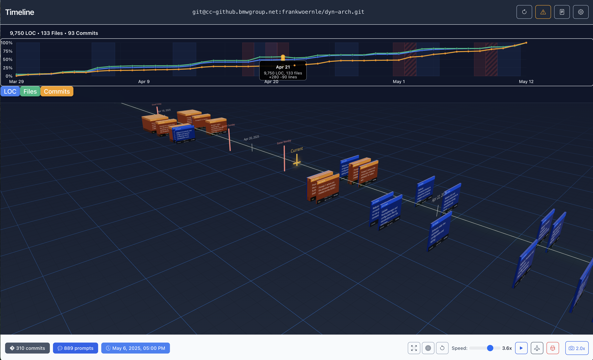

# Timeline Visualization



A sophisticated 3D timeline visualization application that transforms git repository history and specification files into an interactive, immersive 3D experience. Built with React, Three.js, TypeScript, and a Node.js backend, it provides real-time visualization of development workflows with advanced animation and interaction capabilities.

## ✨ Features

### 🎯 Core Visualization
- **3D Timeline Rendering**: Interactive 3D visualization of git commits and spec history
- **Horizontal Metrics Plot**: Real-time code evolution charts showing LOC, files, and commits over time
- **Dual Data Sources**: Displays both git commit history and specification/story timeline
- **Real-time Data**: Fetches live data from repositories with intelligent caching
- **Mock Data Fallback**: Seamless fallback to mock data when repositories unavailable

### 📊 Metrics Visualization
- **Real-time Code Evolution**: Interactive charts showing Lines of Code, Files, and Commits over time
- **Synchronized Timeline**: Metrics plot synchronized with 3D timeline for unified navigation
- **Activity Patterns**: Visualize periods of development activity and inactivity
- **Expandable Interface**: Compact view with expandable detailed metrics display
- **Interactive Filtering**: Toggle individual metrics (LOC, Files, Commits) on/off

### 🎮 Interactive Controls
- **Timeline Navigation**: Click-to-move timeline marker with smooth animations
- **Card Interactions**: Hover and click timeline cards for detailed information
- **Camera Controls**: Multiple camera modes (manual, view-all, focus, drone mode)
- **Auto-drift Mode**: Automated timeline playback with adjustable speed
- **⭐ Timeline Occlusion System**: Advanced visual clarity with intelligent card and marker fading
- **⭐ State Persistence**: Camera position and timeline marker automatically preserved across app reloads

### 🎨 Advanced Animations
- **Smooth Transitions**: Fluid camera movements and card animations
- **Exclusive Card Opening**: Only one card open at a time with guaranteed animation completion
- **Timeline Occlusion**: Intelligent fading of overlapping cards and markers for enhanced visual clarity
- **Text Transparency**: Proper Three.js text transparency with coordinated fade effects
- **Global State Management**: Sophisticated interaction handling prevents stuck UI states
- **Performance Optimized**: 60fps animations with efficient rendering

### 🛠️ Developer Features
- **Professional Logging**: Category-based logging system with real-time control
- **Debug Mode**: Comprehensive debugging tools and performance monitoring
- **Occlusion Debug**: Visual debug markers for occlusion system development
- **Hot Module Replacement**: Instant development feedback with Vite
- **TypeScript**: Full type safety throughout the application

### 🎨 User Experience
- **Responsive Design**: Works on desktop, tablet, and mobile devices
- **Theme Support**: Light, dark, and system theme options
- **⭐ Persistent Settings**: User preferences, camera positions, and timeline state saved across sessions
- **Professional UI**: Modern Bootstrap-based interface with custom styling

## 🏗️ Architecture

### MVI (Model-View-Intent) Pattern with Redux Toolkit

The application follows the **MVI architectural pattern** with **Redux Toolkit** for predictable state management and **automatic state persistence**:


- **Model**: Redux store with organized state slices (timeline, ui, repository, preferences)
- **View**: Pure React components that render based on state
- **Intent**: Action creators and async thunks that handle user interactions and side effects
- **⭐ Persistence**: Automatic state persistence ensures seamless app reload experience

### Frontend Stack
- **React 19** + **TypeScript** for type-safe component development
- **Redux Toolkit** for centralized state management with MVI pattern
- **Three.js** + **React Three Fiber** for 3D rendering and interactions
- **Vite** for fast development and optimized builds
- **Bootstrap 5** for responsive UI components

### Backend Stack
- **Node.js** + **Express** for REST API and git processing
- **File System Caching** for persistent data storage
- **Git Integration** for repository cloning and parsing
- **Mock Data Generation** for development and fallback scenarios

### Key Technologies
- **Redux Toolkit**: Modern Redux with excellent TypeScript support and automatic persistence
- **React Three Fiber**: Declarative 3D programming with React patterns
- **MVI Pattern**: Unidirectional data flow with clear separation of concerns
- **CSS Variables**: Dynamic theming and consistent styling
- **Typed Hooks**: Full TypeScript integration for state management

## 📋 Requirements

- **Node.js 18.0+** (for backend and build tools)
- **Git** (for repository integration and cloning)
- **Modern Browser** with WebGL support (Chrome, Firefox, Safari, Edge)
- **4GB RAM** minimum (8GB recommended for large repositories)

## 🚀 Quick Start

### 1. Installation

```bash
# Clone the repository
git clone [repository-url]
cd timeline

# Install dependencies
npm install
```

### 2. Development

```bash
# Start both frontend and backend servers
npm run dev

# Alternative: Start individually
npm run server  # Backend only (port 3030)
npm start       # Frontend only (port 3001)
```

### 3. Access Application

Open your browser and navigate to `http://localhost:3001`

The application automatically starts both React frontend and Node.js backend servers.

## Usage Guide

### Application Screenshots

#### Settings and Configuration


*Repository Settings dialog showing Git repository URL configuration, theme selection (System/Light/Dark), timezone settings for holiday markers, animation speed control, and auto-drift toggle for automatic timeline scrolling.*


*Professional logging system with real-time configuration. Features hierarchical log levels (ERROR, WARN, INFO, DEBUG, TRACE) and category-based filtering across 18 different subsystems including UI, DATA, CACHE, GIT, SPEC, and THREE.js components.*

#### Interactive Timeline Navigation


*3D timeline view showing commit cards positioned along a temporal axis with the current marker. Demonstrates the spatial organization of git commits in 3D space with the signature yellow timeline marker indicating current position.*


*Detailed commit card view when hovering over timeline events. Shows commit information including title, file changes (+0 ~1 -0), line changes (+20 -10), and date (5/22/2025). Other cards fade intelligently using the timeline occlusion system for enhanced visual clarity.*

### Basic Usage

1. Enter a Git repository URL in the top bar
2. Adjust animation speed using the speed control
3. Toggle auto-drift for automatic timeline scrolling
4. Click on timeline events to view details
5. Use mouse/touch controls to navigate the 3D space:
   - Pan: Left mouse drag / One finger drag
   - Zoom: Mouse wheel / Pinch gesture
   - Rotate: Right mouse drag / Two finger drag

**⭐ Your camera position and timeline marker position are automatically saved and restored when you reload the app!**

### Advanced Visual Features

#### Timeline Occlusion System

When you hover over timeline cards, the application automatically enhances visual clarity:

- **Card Fading**: Other cards that overlap or are temporally close fade to reduce visual noise
- **Marker Fading**: Holiday markers and timeline indicators within the temporal range also fade
- **Text Transparency**: Card text properly fades along with the card materials
- **Debug Mode**: Enable debug mode to see green visual indicators showing which elements are being faded

This intelligent system uses bounding box detection and temporal proximity (+1 day future) to determine which elements should fade, creating a cleaner focus on the card you're examining.

### Configuration

Key configuration options can be customized in `src/config/`:

```typescript
{
  animation: {
    speed: 1,
    autoDrift: false
  },
  visualization: {
    cardSpacing: 2,
    timeScale: 1
  }
}
```

For detailed configuration options, see [Configuration Guide](docs/api.md#configuration).

## Development Setup

### Commands

```bash
# Development
npm run dev          # Start both frontend and backend
npm run server       # Backend only
npm start           # Frontend only

# Build
npm run build       # Production build
npm run build:server # Server build

# Quality
npm run lint        # Lint code
npm run preview     # Preview production build
```

### Architecture Overview

The application uses **Redux Toolkit** with **MVI (Model-View-Intent)** architecture for predictable state management:


**Key Concepts:**
- **Timeline Slice**: Manages events and marker position (with persistence)
- **UI Slice**: Controls camera state, interface, and occlusion system (with persistence)
- **Repository Slice**: Handles repository connections
- **Preferences Slice**: Automatically persists all user settings
- **Occlusion System**: Advanced visual clarity through intelligent element fading


## Browser Compatibility

| Browser           | Minimum Version | Notes                                |
|------------------|----------------|--------------------------------------|
| Chrome           | 91+            | Full support                         |
| Firefox          | 90+            | Full support                         |
| Safari           | 15+            | Full support                         |
| Edge             | 91+            | Full support                         |
| Chrome Mobile    | 91+            | Touch controls supported             |
| Safari iOS       | 15+            | Touch controls supported             |

WebGL 2.0 support is required for 3D visualization.

## Performance Considerations

- Large repositories may take longer to load initially
- Enable hardware acceleration in your browser for best performance
- Adjust animation speed and auto-drift settings based on device capabilities
- Consider using the built-in performance profiling tools for optimization

## 📚 Documentation

### **Architecture & Design**

- **[MVI Architecture](docs/mvi-architecture.md)**: Complete MVI pattern implementation with Redux Toolkit and automatic state persistence
- **[State Management](docs/state-management.md)**: Redux Toolkit guide with async thunks, persistence, and best practices
- **[Architecture Overview](docs/architecture.md)**: Complete system architecture and design decisions

### **Development Resources**

- **[Development Guide](docs/development-guide.md)**: Setup, workflows, and MVI development patterns
- **[API Reference](docs/api-reference.md)**: Redux store APIs, backend endpoints, and component interfaces
- **[Product Requirements](docs/product-requirements.md)**: Original product specifications and features

### **Visual Documentation**

All architecture diagrams are available as PNG files in `docs/images/`:

#### **Core Architecture Diagrams**
- **[MVI Architecture](docs/images/updated-mvi-architecture.png)**: Model-View-Intent pattern with Redux Toolkit
- **[Redux Store Structure](docs/images/updated-redux-store.png)**: Complete state management schema
- **[Component Integration](docs/images/component-integration-updated.png)**: How React components connect to Redux
- **[Data Flow Diagram](docs/images/mvi-data-flow.png)**: Complete MVI data flow with persistence

#### **Sequence Diagrams**
- **[Marker Persistence Flow](docs/images/marker-persistence-sequence.png)**: Timeline marker position persistence
- **[Occlusion System Flow](docs/images/occlusion-system-flow.png)**: Timeline occlusion system workflow and state management
- **[MVI Sequence Diagram](docs/images/mvi-sequence-diagram.png)**: Detailed interaction flows
- **[Metrics Visualization Flow](docs/images/metrics-visualization-sequence.png)**: Horizontal metrics plot data flow

#### **Metrics Visualization Diagrams**
- **[Metrics Architecture](docs/images/metrics-visualization-architecture.png)**: Horizontal metrics plot system design
- **[Metrics Data Flow](docs/images/metrics-visualization-sequence.png)**: Time interpolation and synchronization

#### **Legacy Diagrams**
- **[Core Architecture](docs/images/core-architecture.png)**: System overview and technology stack
- **[State Flow Diagram](docs/images/state-flow-diagram.png)**: Original data flow visualization

### **Quick References**

- **Component Structure**: See `src/components/` for React components
- **Metrics Visualization**: See [Metrics API Documentation](docs/metrics-visualization-api.md) for detailed usage
- **Redux Store**: See `src/store/` for state management (slices, intents, types)
- **Type Definitions**: See `src/data/types/` for TypeScript interfaces
- **Configuration**: See `src/config/` for app configuration
- **Logging System**: See `src/utils/logging/` for debug tools

> **Note**: All PlantUML source files are available in `docs/puml/` for easy modification and regeneration of diagrams.

## State Persistence

The application automatically preserves your session state:

### **What's Persisted**
- **Camera Position**: Exact camera position, target, and zoom level
- **Timeline Marker**: Current position on the timeline
- **User Preferences**: Theme, animation settings, repository URLs
- **View Settings**: Last used camera mode and animation speed

### **How It Works**
- State is automatically saved to localStorage on every change
- On app reload, your exact view is restored
- Uses Redux Toolkit with MVI pattern for predictable state management
- Persistence is handled through the intent layer for consistency


## 🤝 Contributing

We welcome contributions! Please see our [Development Guide](docs/development-guide.md) for:
- Development environment setup
- Code style guidelines
- Testing procedures
- Pull request process

## Troubleshooting

Common issues and solutions:

1. **White screen / No visualization**
   - Check if WebGL is enabled in your browser
   - Verify hardware acceleration is enabled
   - Clear browser cache and reload

2. **Slow performance**
   - Reduce animation speed
   - Disable auto-drift for low-end devices
   - Close other resource-intensive browser tabs

3. **Repository loading fails**
   - Verify repository URL is correct and accessible
   - Check network connection
   - Ensure repository is public or credentials are provided

4. **State not persisting**
   - Check if localStorage is enabled in your browser
   - Verify you're not in incognito/private mode
   - Clear localStorage and reload if state becomes corrupted

## 📄 License

This project is licensed under the MIT License - see the LICENSE file for details.

## 🆘 Support

For help and support:
1. Check the [comprehensive documentation](docs/)
2. Review [common troubleshooting issues](docs/development-guide.md#troubleshooting)
3. Create an issue in the repository
4. Use the built-in logging system for debugging