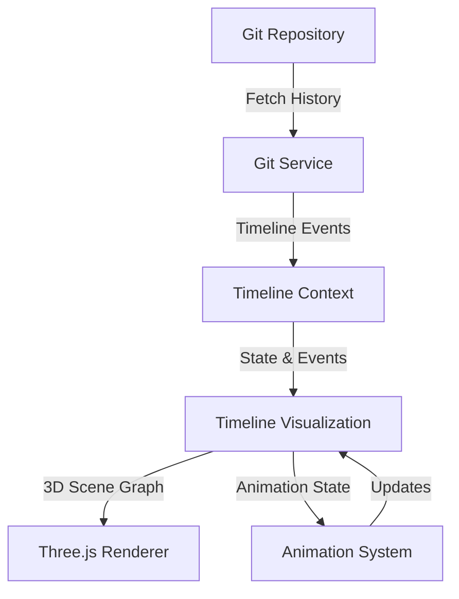
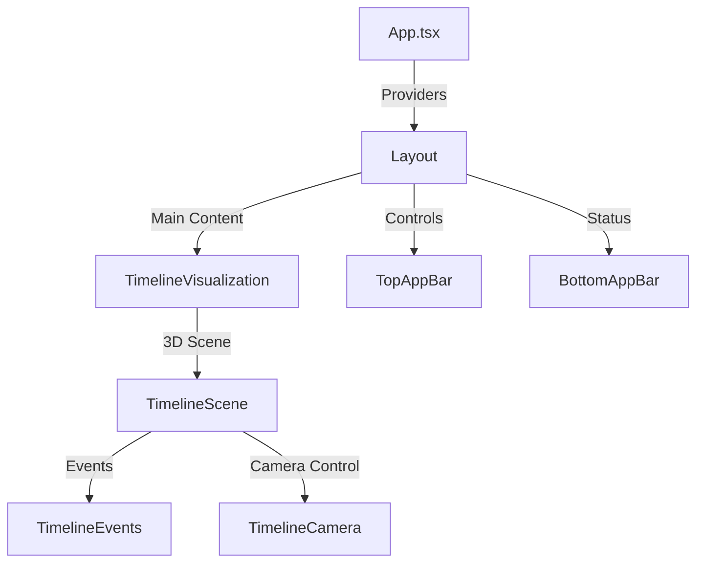
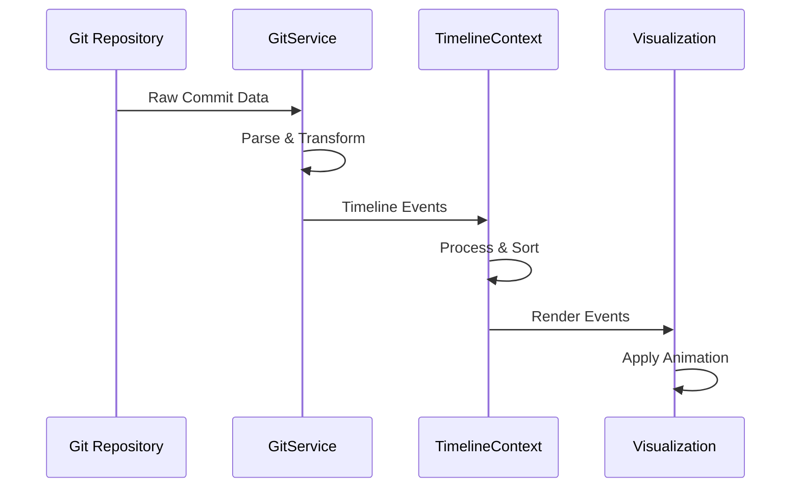

# Timeline Visualization Architecture

## System Overview

The Timeline Visualization application is built using a modern React-based architecture with Three.js for 3D rendering. The system is designed to provide an interactive, performant visualization of git commit history in three-dimensional space.

## Component Structure

### Core Components

1. **App.tsx**
   - Root component
   - Manages global state providers
   - Handles error boundaries

2. **Layout Component**
   - Controls overall application layout
   - Manages navigation and control bars
   - Handles responsive design

3. **TimelineVisualization**
   - Core visualization component
   - Integrates timeline data
   - Manages animation state
   - Coordinates 3D rendering

4. **Three.js Components**
   - TimelineScene: Main 3D scene container
   - TimelineEvents: Renders timeline events in 3D
   - TimelineCamera: Manages camera positioning and movement

### State Management

The application uses React Context for state management:

1. **TimelineContext**
   - Manages timeline data and state
   - Handles event selection and filtering
   - Provides timeline manipulation methods

2. **ConfigContext**
   - Manages application configuration
   - Handles user preferences
   - Provides configuration utilities

## Data Flow

### Git Data Pipeline

1. **Data Fetching**
   - GitService fetches repository history
   - Commits are transformed into TimelineEvents
   - Events are processed and sorted chronologically

2. **Data Processing**
   - Events are normalized and enhanced
   - Timestamps are converted to spatial positions
   - Relationships between events are calculated

3. **Visualization Pipeline**
   - Events are converted to 3D coordinates
   - Animation system updates positions
   - Camera system manages viewpoint

## Event System

The application implements a comprehensive event system:

1. **User Interactions**
   - Click/tap: Select timeline event
   - Drag: Pan camera
   - Pinch/scroll: Zoom camera
   - Double-click: Focus event

2. **Animation Events**
   - Auto-scroll updates
   - Camera transitions
   - Card animations

## Performance Optimization

### Rendering Optimizations

1. **Three.js Optimizations**
   - Object pooling for timeline cards
   - Frustum culling for off-screen elements
   - Instanced rendering for similar objects

2. **React Optimizations**
   - Memoization of expensive calculations
   - Virtualization of timeline events
   - Deferred loading of distant events

### State Management Optimizations

1. **Context Optimizations**
   - Selective context updates
   - State segmentation
   - Computed value caching

2. **Data Management**
   - Incremental data loading
   - Data pagination
   - Cache management

## Technical Decisions

### Technology Choices

1. **React + TypeScript**
   - Type safety and developer experience
   - Component reusability
   - Modern tooling support

2. **Three.js + React Three Fiber**
   - Powerful 3D rendering capabilities
   - React integration
   - Active community and ecosystem

3. **Vite**
   - Fast development server
   - Efficient build process
   - Modern module support

### Key Architecture Decisions

1. **Component Structure**
   - Separation of 3D and UI components
   - Modular animation system
   - Flexible configuration system

2. **State Management**
   - Context-based state management
   - Prop drilling minimization
   - Efficient updates

3. **Performance Strategy**
   - Lazy loading
   - Progressive enhancement
   - Resource management

## Caching Strategy

1. **Data Caching**
   - Git commit history caching
   - Event calculation memoization
   - Configuration persistence

2. **Resource Caching**
   - Texture and material sharing
   - Geometry instancing
   - Asset preloading

## Future Considerations

1. **Scalability**
   - Support for larger repositories
   - Improved performance optimizations
   - Enhanced caching mechanisms

2. **Feature Extensions**
   - Additional visualization modes
   - Enhanced filtering capabilities
   - Collaborative features

3. **Technical Improvements**
   - WebGL 2.0 features utilization
   - Web Workers for computation
   - Progressive Web App capabilities