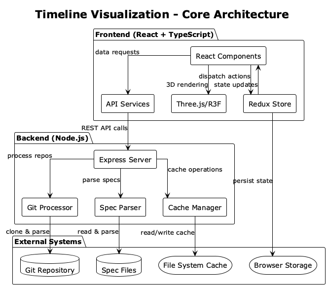
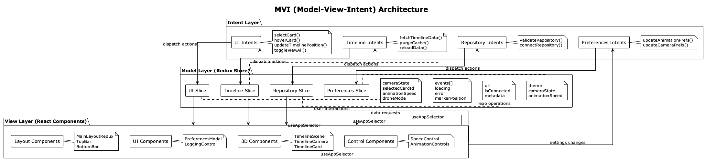
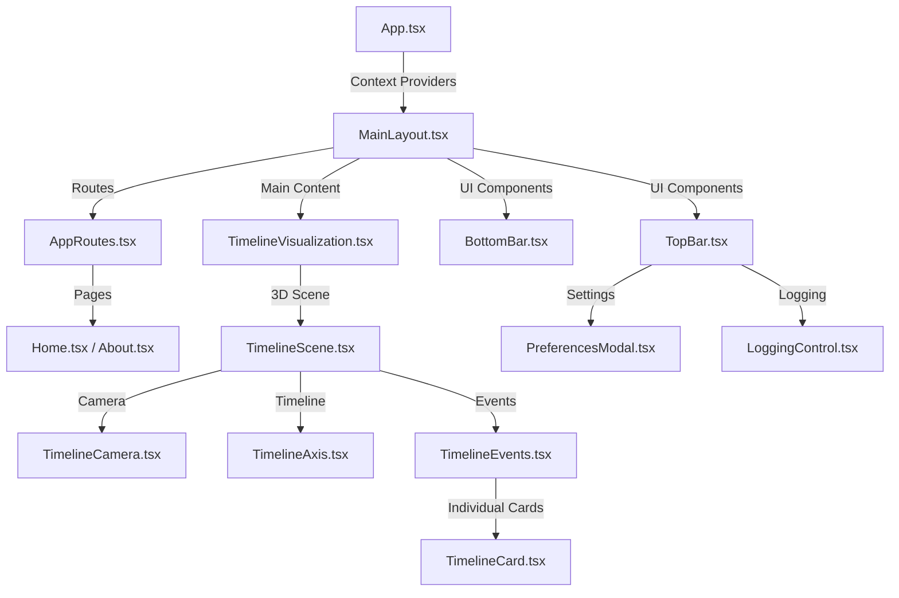
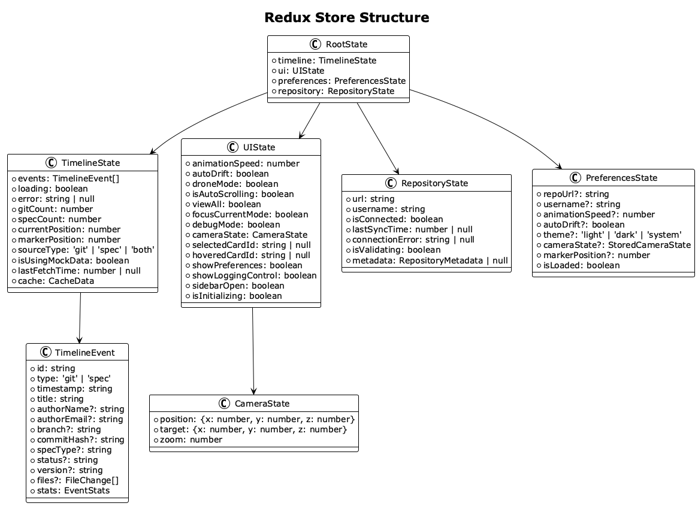
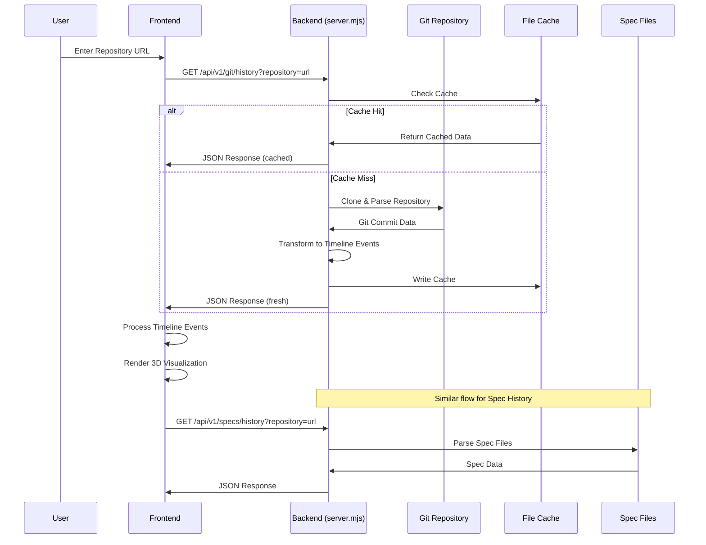

# Timeline Visualization Architecture

## System Overview

The Timeline Visualization application is a sophisticated 3D timeline visualization tool that displays both git commit history and specification history in an interactive 3D environment. Built with React, TypeScript, Three.js, and a Node.js backend, it provides real-time visualization of repository data with advanced animation and interaction capabilities.

The application follows the **MVI (Model-View-Intent)** architectural pattern with **Redux Toolkit** for centralized state management, providing predictable state updates and excellent developer experience.

### Core Architecture

### Technology Stack

- **Frontend**: React 19 + TypeScript + Vite
- **3D Rendering**: Three.js + React Three Fiber + Drei
- **Backend**: Node.js + Express (server.mjs)
- **Styling**: Bootstrap 5 + Custom CSS Variables
- **State Management**: Redux Toolkit + MVI Pattern
- **Build Tool**: Vite with HMR
- **Package Manager**: npm

## MVI (Model-View-Intent) Architecture

The application implements the MVI architectural pattern, which provides a unidirectional data flow and clear separation of concerns:

### MVI Components

#### **Model (Redux Store)**
- **Central State Store**: Single source of truth for all application state
- **Immutable State**: State updates through pure reducer functions
- **Time Travel Debugging**: Redux DevTools for state inspection and debugging
- **Predictable Updates**: All state changes are traceable and reproducible

#### **View (React Components)**
- **Pure Presentation**: Components receive state via props and render UI
- **No Direct State Mutation**: Components only dispatch intents/actions
- **Reactive Updates**: Automatic re-rendering when state changes
- **Component Isolation**: Each component focuses on specific UI concerns

#### **Intent (Action Creators & Thunks)**
- **User Intent Capture**: Translate user interactions into actionable intents
- **Async Operations**: Handle complex async workflows with Redux Thunks
- **Side Effect Management**: Coordinate API calls, animations, and state updates
- **Business Logic**: Encapsulate domain logic in reusable intent functions

## Application Architecture

### Frontend Component Hierarchy

### Core Components

#### **1. Application Root (App.tsx)**
- **Purpose**: Application entry point and global setup
- **Responsibilities**:
  - Initializes global context providers (PreferencesProvider, ThemeProvider)
  - Sets up React Router for navigation
  - Configures global logging system
  - Provides error boundaries

#### **2. Main Layout (MainLayout.tsx)**
- **Purpose**: Primary application layout and state management
- **Responsibilities**:
  - Manages repository URL and loading states
  - Coordinates data fetching and error handling
  - Provides props to child components
  - Handles responsive design breakpoints
  - Manages camera state persistence

#### **3. Timeline Visualization (TimelineVisualization.tsx)**
- **Purpose**: Core 3D visualization orchestrator
- **Responsibilities**:
  - Fetches and processes timeline data from backend
  - Manages animation states and user interactions
  - Coordinates between data layer and 3D rendering
  - Handles loading states and error recovery
  - Provides data to 3D scene components

#### **4. Timeline Scene (TimelineScene.tsx)**
- **Purpose**: 3D scene container and interaction manager
- **Responsibilities**:
  - Sets up Three.js Canvas and environment
  - Manages global 3D scene state
  - Handles background click detection for card closure
  - Coordinates camera, timeline, and event components
  - Provides lighting and environment setup

## Redux State Management

The application uses Redux Toolkit with the MVI pattern for centralized state management:

### Store Architecture

The Redux store is organized into four main slices:

#### **Timeline Slice** (`src/store/slices/timelineSlice.ts`)
- **Purpose**: Manages timeline events and data state
- **State**: Events array, loading states, error handling, marker position
- **Actions**: setEvents, setLoading, setMarkerPosition, resetTimeline
- **Cache Management**: Handles data caching and mock data fallback

#### **UI Slice** (`src/store/slices/uiSlice.ts`)
- **Purpose**: Controls user interface state and interactions
- **State**: Camera state, animation settings, card selection, view modes
- **Actions**: updateCameraState, setSelectedCardId, setDroneMode, setViewAll
- **Interaction Management**: Handles complex UI state coordination

#### **Repository Slice** (`src/store/slices/repositorySlice.ts`)
- **Purpose**: Manages repository connection and metadata
- **State**: Repository URL, connection status, validation state, metadata
- **Actions**: setRepositoryUrl, setIsConnected, setMetadata, resetRepository
- **Connection Handling**: Tracks repository validation and sync status

#### **Preferences Slice** (`src/store/slices/preferencesSlice.ts`)
- **Purpose**: Handles user preferences with automatic persistence
- **State**: Theme, animation settings, camera preferences, repository settings
- **Actions**: updatePreferences, setPreferences, refreshPreferences
- **Persistence**: Automatically saves to localStorage on updates

### Intent Layer (Async Thunks)

Complex user interactions are handled through async thunks in the intent layer:

#### **UI Intents** (`src/store/intents/uiIntents.ts`)
- `selectCard()`: Handles card selection with camera coordination
- `updateTimelinePosition()`: Updates marker position with camera sync
- `toggleViewAll()`: Manages view mode transitions
- `focusOnCurrentPosition()`: Coordinates camera focus operations

#### **Timeline Intents** (`src/store/intents/timelineIntents.ts`)
- `fetchTimelineData()`: Handles data fetching with caching and error recovery
- `purgeTimelineCache()`: Manages cache invalidation
- `reloadTimelineData()`: Coordinates data refresh operations

### State Management Architecture

The application combines Redux Toolkit with React patterns for optimal performance:

#### **1. Global Context Providers**

**PreferencesContext** (`src/context/PreferencesContext.tsx`)
- **Purpose**: Manages user preferences and settings
- **State**: Repository URL, animation speed, theme, camera state, credentials
- **Persistence**: Automatically saves to localStorage
- **Usage**: Available throughout the app via `usePreferences()` hook

**ThemeProvider** (`src/context/ThemeProvider.tsx`)
- **Purpose**: Manages application theming
- **Responsibilities**: Applies theme classes to document body based on user preference
- **Themes**: Light, Dark, System (follows OS preference)

#### **2. Custom Data Hooks**

**useTimelineData** (`src/data/hooks/useTimelineData.ts`)
- **Purpose**: Manages timeline data fetching and caching
- **Features**:
  - Fetches git and spec history from backend
  - Implements caching with localStorage
  - Handles loading states and error recovery
  - Provides data filtering capabilities
  - Manages mock data fallback

**useTimelineAnimation** (`src/data/hooks/useTimelineAnimation.ts`)
- **Purpose**: Manages 3D animation states and interactions
- **Features**:
  - Auto-scrolling timeline animation
  - Card selection and hover states
  - Camera target management
  - Animation speed control

**useRepositoryStorage** (`src/data/hooks/useRepositoryStorage.ts`)
- **Purpose**: Handles repository data persistence
- **Features**:
  - Saves/loads repository data to localStorage
  - Manages cache expiration
  - Tracks mocked data status

#### **3. Component-Level State**

**Local State Management**:
- Individual components manage their own UI state
- Animation states are handled by custom hooks
- Form states use controlled components
- 3D object states use React Three Fiber patterns

## Data Flow Architecture

### Complete Data Pipeline

### Backend Architecture (server.mjs)

#### **API Endpoints**

1. **Health Check**: `GET /api/v1/health`
   - Returns server status and uptime
   - Used for monitoring backend availability

2. **Git History**: `GET /api/v1/git/history?repository=<url>`
   - Fetches git commit history from repository
   - Implements caching with file system storage
   - Falls back to mock data if repository unavailable

3. **Spec History**: `GET /api/v1/specs/history?repository=<url>`
   - Fetches specification/story history from repository
   - Parses spec files for timeline events
   - Falls back to mock data if no spec files found

4. **Cache Management**:
   - `POST /api/v1/purge?repository=<url>` - Soft purge (cache files only)
   - `POST /api/v1/purge/hard?repository=<url>` - Hard purge (cache + cloned repo)
   - `POST /api/v1/purge/git?repository=<url>` - Purge git cache only
   - `POST /api/v1/purge/spec?repository=<url>` - Purge spec cache only

#### **Caching Strategy**

**File System Cache** (`.timeline-cache/` directory):
- **Cache Files**: `{sanitized-repo-url}.git.json`, `{sanitized-repo-url}.spec.json`
- **Repository Clones**: `{sanitized-repo-url}/` directories
- **Cache Invalidation**: Manual via purge endpoints
- **Mock Data Fallback**: Automatic when real data unavailable

#### **Data Processing**

**Git Data Processing**:
- Clones repository to local file system
- Parses git log with file statistics
- Transforms commits into standardized timeline events
- Calculates file change statistics (added/modified/deleted lines)

**Spec Data Processing**:
- Searches for specification files in repository
- Parses spec files for timeline events
- Extracts metadata (prompts, tool invocations, file changes)
- Generates timeline events with statistics

## 3D Visualization System

### Three.js Components Architecture

#### **TimelineCamera.tsx**
- **Purpose**: Manages 3D camera positioning and movement
- **Features**:
  - Multiple camera modes (view all, focus current, drone mode)
  - Smooth camera transitions with easing
  - User interaction handling (orbit controls)
  - Camera state persistence
  - Debug mode for development

#### **TimelineAxis.tsx**
- **Purpose**: Renders the main timeline axis and marker
- **Features**:
  - 3D timeline axis with tick marks
  - Draggable timeline marker (yellow pin)
  - Timeline hover detection zones
  - Date/time labeling
  - Interactive click-to-move functionality

#### **TimelineEvents.tsx**
- **Purpose**: Container for all timeline event cards
- **Features**:
  - Manages collection of TimelineCard components
  - Handles card positioning along timeline
  - Coordinates card interactions and animations
  - Implements global card state management

#### **TimelineCard.tsx**
- **Purpose**: Individual 3D cards representing timeline events
- **Features**:
  - Complex hover/click animations (slide, rotate, scale)
  - Card content rendering (title, date, statistics)
  - Exclusive card opening system
  - Global click-outside-to-close functionality
  - Animation state tracking and completion guarantees

### Animation System

#### **Card Animation States**
1. **Idle State**: Card at original position and scale
2. **Hover State**: Card slides out, rotates toward camera, scales up
3. **Opening Animation**: Smooth transition to hover state
4. **Closing Animation**: Return to idle state
5. **Force Close**: Emergency close via global state management

#### **Camera Animation Modes**
1. **Manual Mode**: User controls camera with mouse/touch
2. **View All Mode**: Camera positioned to show entire timeline
3. **Focus Current Mode**: Camera focused on current timeline position
4. **Drone Mode**: Automated camera movement around timeline marker
5. **Auto Drift Mode**: Timeline marker moves automatically

#### **Global Animation Coordination**
- **Exclusive Card Opening**: Only one card can be open at a time
- **Animation Completion Guarantees**: Cards always complete their animations
- **Global State Tracking**: Cards register/unregister when opening/closing
- **Background Click Detection**: Large invisible mesh catches clicks outside interactive elements

### User Interaction System

#### **Mouse/Touch Interactions**
1. **Card Interactions**:
   - **Hover**: Triggers card opening animation
   - **Click**: Selects card (yellow border)
   - **Mouse Leave**: Triggers card closing animation (with debouncing)

2. **Timeline Interactions**:
   - **Hover over timeline**: Shows yellow marker pin
   - **Click on timeline**: Moves marker to clicked position
   - **Drag marker**: Interactive timeline scrubbing

3. **Camera Interactions**:
   - **Mouse drag**: Orbit camera around target
   - **Mouse wheel**: Zoom in/out
   - **Touch gestures**: Pan and pinch-to-zoom on mobile

4. **Background Interactions**:
   - **Click outside**: Closes all open cards and clears selections

#### **Keyboard Interactions**
- **Space**: Toggle auto-drift mode
- **R**: Reset camera to default position
- **V**: Toggle view-all mode
- **F**: Toggle focus-current mode

### State Management in 3D Space

#### **Global Card State** (`src/utils/three/cardUtils.ts`)
- **Open Cards Registry**: Tracks which cards are currently open
- **Animating Cards Registry**: Tracks cards currently in animation
- **Force Close System**: Allows global closure of stuck cards
- **Background Click Handler**: Detects clicks outside interactive elements

#### **Animation State Coordination**
- **Timeline Marker State**: Synchronized across all components
- **Camera Target State**: Shared between camera and timeline components
- **Card Hover State**: Managed globally to prevent conflicts
- **Loading States**: Coordinated between data fetching and UI components

## Performance Optimization

### Frontend Optimizations

#### **React Performance**
- **Memoization**: Expensive calculations cached with `useMemo` and `useCallback`
- **Component Optimization**: Strategic use of `React.memo` for pure components
- **State Batching**: Multiple state updates batched to prevent unnecessary re-renders
- **Lazy Loading**: Components loaded on-demand to reduce initial bundle size

#### **Three.js Performance**
- **Object Reuse**: Timeline cards reuse geometries and materials
- **Frustum Culling**: Off-screen objects automatically culled by Three.js
- **Animation Optimization**: Smooth animations with requestAnimationFrame
- **Memory Management**: Proper disposal of Three.js objects to prevent memory leaks

#### **Data Management**
- **Caching Strategy**: Multi-level caching (localStorage + backend file cache)
- **Debounced Updates**: User interactions debounced to prevent excessive API calls
- **Selective Updates**: Only necessary components re-render on state changes
- **Background Processing**: Heavy computations moved to backend

### Backend Optimizations

#### **Caching Strategy**
- **File System Cache**: Persistent cache survives server restarts
- **Operation Locking**: Prevents duplicate operations on same repository
- **Cache Invalidation**: Manual cache control via API endpoints
- **Mock Data Fallback**: Instant fallback when real data unavailable

#### **Git Processing**
- **Incremental Parsing**: Only parse new commits when possible
- **Efficient Cloning**: Shallow clones for faster repository access
- **Parallel Processing**: Multiple repositories can be processed simultaneously
- **Resource Management**: Automatic cleanup of temporary files

## Logging System

### Architecture (`src/utils/logging/`)

#### **Logger Class** (`Logger.ts`)
- **Centralized Logging**: Single point for all application logging
- **Category System**: Organized logging by functional areas
- **Level Control**: Configurable log levels (TRACE, DEBUG, INFO, WARN, ERROR)
- **Conditional Logging**: Logs only appear when enabled for specific categories/levels

#### **Categories**
- **LIFECYCLE**: Application startup, shutdown, major state changes
- **UI**: User interface interactions, component lifecycle
- **DATA**: Data fetching, processing, caching operations
- **ANIMATION**: 3D animations, camera movements, transitions
- **CONFIG**: Configuration changes, preferences updates
- **CACHE**: Cache operations, storage management
- **PERFORMANCE**: Performance metrics, timing information

#### **Logging Control UI** (`LoggingControl.tsx`)
- **Interactive Control Panel**: Toggle logging categories and levels
- **Visual Indicators**: Color-coded categories and levels
- **Hierarchical Levels**: Higher levels automatically enable lower levels
- **Real-time Updates**: Changes take effect immediately

#### **Custom Hook** (`useLogger.ts`)
- **Component-Specific Loggers**: Each component gets its own logger instance
- **Automatic Context**: Includes component name and topic in all log messages
- **Type Safety**: TypeScript interfaces ensure correct usage
- **Performance**: Minimal overhead when logging disabled

## Technical Decisions

### Technology Choices

#### **Frontend Stack**
1. **React 19 + TypeScript**
   - **Rationale**: Type safety, excellent developer experience, component reusability
   - **Benefits**: Compile-time error detection, IntelliSense support, maintainable codebase
   - **Trade-offs**: Larger bundle size, learning curve for TypeScript

2. **Three.js + React Three Fiber**
   - **Rationale**: Powerful 3D rendering with React integration
   - **Benefits**: Declarative 3D programming, React component model, active ecosystem
   - **Trade-offs**: Performance overhead compared to vanilla Three.js

3. **Vite + HMR**
   - **Rationale**: Fast development server, efficient build process
   - **Benefits**: Instant hot module replacement, modern ES modules, fast builds
   - **Trade-offs**: Newer tool with smaller ecosystem than Webpack

#### **Backend Stack**
1. **Node.js + Express**
   - **Rationale**: JavaScript everywhere, simple REST API, file system access
   - **Benefits**: Shared language with frontend, npm ecosystem, easy deployment
   - **Trade-offs**: Single-threaded, not ideal for CPU-intensive tasks

2. **File System Caching**
   - **Rationale**: Simple, persistent, no external dependencies
   - **Benefits**: Survives server restarts, easy to debug, no database setup
   - **Trade-offs**: Not suitable for distributed systems, manual cache management

### Key Architecture Decisions

#### **1. Hybrid State Management**
- **Decision**: Combine React Context, custom hooks, and local state
- **Rationale**: Different state types need different management strategies
- **Benefits**: Optimal performance, clear separation of concerns, maintainable code

#### **2. Backend-First Data Processing**
- **Decision**: Process git data on backend, not frontend
- **Rationale**: Heavy git operations should not block UI
- **Benefits**: Better performance, cacheable results, reduced frontend complexity

#### **3. Global 3D Interaction System**
- **Decision**: Centralized card state management with global click detection
- **Rationale**: Complex 3D interactions need coordinated state management
- **Benefits**: Reliable interaction handling, no stuck UI states, better UX

#### **4. Professional Logging System**
- **Decision**: Comprehensive logging with category-based control
- **Rationale**: Complex 3D application needs sophisticated debugging tools
- **Benefits**: Easier debugging, performance monitoring, production troubleshooting

## Configuration Management

### Configuration Architecture (`src/config/`)

#### **Modular Configuration**
- **colors.ts**: Color schemes, themes, CSS variables
- **dimensions.ts**: Layout dimensions, breakpoints, z-index values
- **animation.ts**: Animation timings, easing functions, performance settings

#### **CSS Variables Integration**
- **Dynamic Theming**: CSS variables updated based on user preferences
- **Consistent Styling**: Shared color palette across components
- **Runtime Updates**: Theme changes applied without page reload

## Development Workflow

### Local Development Setup
1. **Prerequisites**: Node.js 18+, Git, modern browser with WebGL
2. **Installation**: `npm install` for dependencies
3. **Development**: `npm run dev` starts both frontend and backend
4. **Ports**: Frontend (3001), Backend (3030), with automatic port detection

### Build Process
1. **Development Build**: Vite dev server with HMR
2. **Production Build**: `npm run build` creates optimized bundle
3. **Server Build**: TypeScript compilation for backend
4. **Concurrent Development**: Frontend and backend run simultaneously

### Testing Strategy
- **Component Testing**: React Testing Library for UI components
- **Integration Testing**: End-to-end testing for user workflows
- **Performance Testing**: Three.js performance monitoring
- **API Testing**: Backend endpoint testing with mock data

## Future Considerations

### Scalability Improvements
1. **Large Repository Support**
   - Implement data pagination for repositories with thousands of commits
   - Add virtual scrolling for timeline events
   - Optimize memory usage for large datasets

2. **Performance Enhancements**
   - Implement Web Workers for heavy computations
   - Add service worker for offline functionality
   - Optimize Three.js rendering with instancing and LOD

### Feature Extensions
1. **Enhanced Visualization**
   - Multiple timeline view modes (branching, parallel tracks)
   - Interactive filtering and search capabilities
   - Export functionality (images, videos, data)

2. **Collaboration Features**
   - Real-time collaboration on timeline exploration
   - Shared bookmarks and annotations
   - Team workspace management

3. **Integration Capabilities**
   - Support for additional version control systems
   - Integration with project management tools
   - Custom data source plugins

### Technical Improvements
1. **Modern Web Technologies**
   - Progressive Web App capabilities
   - WebGL 2.0 features utilization
   - WebAssembly for performance-critical operations

2. **Developer Experience**
   - Comprehensive testing suite
   - Automated deployment pipeline
   - Enhanced debugging tools and documentation