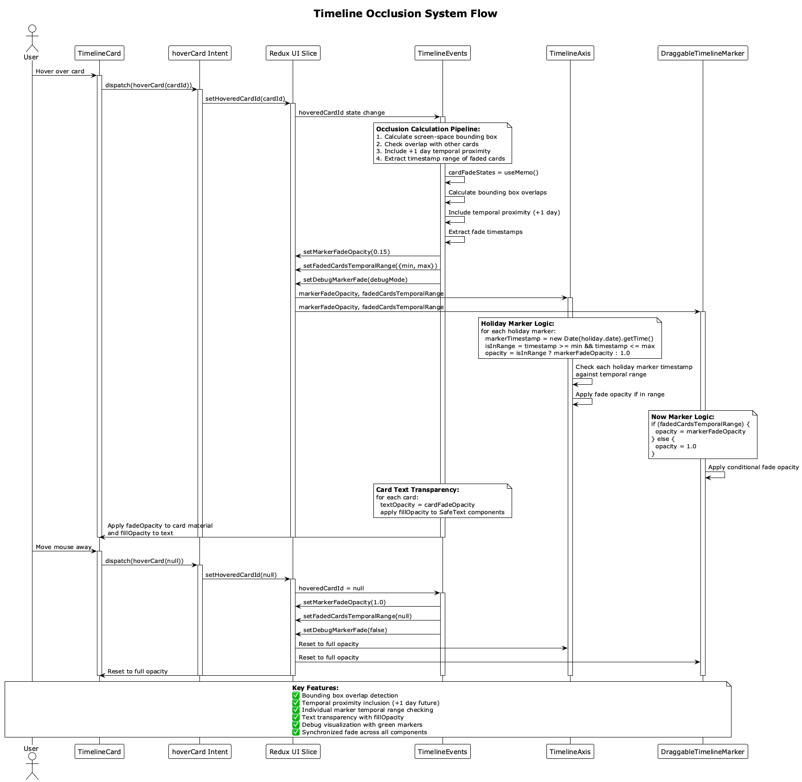

# Comprehensive Development Guide

## Getting Started

This guide provides complete development setup, workflow, architecture understanding, and best practices for the Timeline Visualization project.

## Prerequisites

### Required Software
- **Node.js 18.0+** (LTS recommended)
- **Git** (latest version)
- **Modern Browser** with WebGL 2.0 support
- **Code Editor** (VS Code recommended)

### Recommended VS Code Extensions
- TypeScript and JavaScript Language Features
- ES7+ React/Redux/React-Native snippets
- Prettier - Code formatter
- ESLint
- Auto Rename Tag
- Bracket Pair Colorizer
- GitLens
- Three.js Snippets

## Development Environment Setup

### 1. Repository Setup

```bash
# Clone the repository
git clone [repository-url]
cd timeline

# Install dependencies
npm install

# Verify installation
npm run build:server  # Should complete without errors
```

### 2. Development Servers

```bash
# Start both frontend and backend (recommended)
npm run dev

# Alternative: Start individually
npm run server  # Backend only (port 3030)
npm run start   # Frontend only (port 3001)
```

### 3. Environment Configuration

```bash
# Create .env file for backend
echo "PORT=3030" > .env
echo "NODE_ENV=development" >> .env

# Create .env.local for frontend
echo "VITE_API_BASE_URL=http://localhost:3030" > .env.local
echo "VITE_DEBUG_MODE=true" >> .env.local
```

## Project Architecture

### Directory Structure

```
timeline/
├── src/                          # Frontend source code
│   ├── components/               # React components
│   │   ├── layout/              # Layout components
│   │   ├── three/               # Three.js components
│   │   └── ui/                  # UI components
│   ├── data/                    # Data management layer
│   │   ├── hooks/               # Custom React hooks
│   │   ├── services/            # API services
│   │   └── types/               # TypeScript types
│   ├── utils/                   # Utility functions
│   │   ├── logging/             # Logging system
│   │   └── three/               # Three.js utilities
│   ├── config/                  # Configuration files
│   ├── context/                 # React context providers
│   ├── layouts/                 # Page layouts
│   └── pages/                   # Page components
├── docs/                        # Documentation
├── public/                      # Static assets
├── server.mjs                   # Backend API server
├── .timeline-cache/             # Backend cache (auto-created)
└── package.json                 # Dependencies and scripts
```

### Key Components

#### **Frontend Components**
- **App.tsx**: Root component with global providers
- **MainLayout.tsx**: Main layout with state management
- **TimelineVisualization.tsx**: Core 3D visualization
- **TimelineScene.tsx**: Three.js scene container
- **TimelineCamera.tsx**: Camera control system
- **TimelineCard.tsx**: Individual timeline cards

#### **Backend Architecture**
- **server.mjs**: Main API server
- **Git Processing**: Repository cloning and parsing
- **Caching System**: File system cache for performance
- **Mock Data**: Fallback data generation

## MVI Development Patterns

### State Management with Redux

The application uses Redux Toolkit following the MVI pattern, including advanced features like the **timeline occlusion system** for enhanced visual clarity:

#### **Setting Up Redux in Components**

```typescript
// Import typed hooks
import { useAppDispatch, useAppSelector } from '../store';

// Import actions and intents
import { setSelectedCardId, setHoveredCardId } from '../store/slices/uiSlice';
import { selectCard, hoverCard, updateTimelinePosition } from '../store/intents/uiIntents';

const MyComponent: React.FC = () => {
  const dispatch = useAppDispatch();

  // Select state (View layer)
  const selectedCardId = useAppSelector(state => state.ui.selectedCardId);
  const events = useAppSelector(state => state.timeline.events);

  // Dispatch intents (Intent layer)
  const handleCardClick = useCallback((cardId: string) => {
    dispatch(selectCard({ cardId }));
  }, [dispatch]);
  
  // Occlusion system integration
  const handleCardHover = useCallback((cardId: string | null) => {
    dispatch(hoverCard(cardId)); // Triggers occlusion calculations
  }, [dispatch]);

  return (
    <div>
      {events.map(event => (
        <Card
          key={event.id}
          selected={selectedCardId === event.id}
          onClick={() => handleCardClick(event.id)}
        />
      ))}
    </div>
  );
};
```

#### **Creating New State Slices**

```typescript
// src/store/slices/newFeatureSlice.ts
import { createSlice, PayloadAction } from '@reduxjs/toolkit';

interface NewFeatureState {
  data: any[];
  loading: boolean;
  error: string | null;
}

const initialState: NewFeatureState = {
  data: [],
  loading: false,
  error: null,
};

const newFeatureSlice = createSlice({
  name: 'newFeature',
  initialState,
  reducers: {
    setLoading: (state, action: PayloadAction<boolean>) => {
      state.loading = action.payload;
    },
    setData: (state, action: PayloadAction<any[]>) => {
      state.data = action.payload;
      state.loading = false;
    },
    setError: (state, action: PayloadAction<string>) => {
      state.error = action.payload;
      state.loading = false;
    },
  },
});

export const { setLoading, setData, setError } = newFeatureSlice.actions;
export default newFeatureSlice.reducer;
```

#### **Creating Async Intents**

```typescript
// src/store/intents/newFeatureIntents.ts
import { createAsyncThunk } from '@reduxjs/toolkit';
import type { RootState } from '../index';
import { setLoading, setData, setError } from '../slices/newFeatureSlice';

export const fetchNewFeatureData = createAsyncThunk<
  any[],
  { param: string },
  { state: RootState }
>(
  'newFeature/fetchData',
  async ({ param }, { dispatch, getState }) => {
    dispatch(setLoading(true));

    try {
      const response = await fetch(`/api/data/${param}`);
      const data = await response.json();

      dispatch(setData(data));
      return data;
    } catch (error) {
      dispatch(setError(error.message));
      throw error;
    }
  }
);
```

### Timeline Occlusion System Development

The timeline implements an advanced occlusion system for enhanced visual clarity. Here's how to work with it:



#### **Understanding the Occlusion System**

The occlusion system automatically fades markers and cards when a timeline card is hovered, using:
- **Bounding box overlap detection** in screen space
- **Temporal proximity** (cards within +1 day future)
- **Individual marker logic** for precise temporal range checking
- **Text transparency** with Three.js `fillOpacity`

#### **Implementing Occlusion in Components**

```typescript
// TimelineCard component with occlusion support
const TimelineCard: React.FC<TimelineCardProps> = ({ 
  event, 
  fadeOpacity, // Passed from occlusion system
  onHover 
}) => {
  // Apply fade opacity to card material
  const cardOpacity = fadeOpacity;
  
  // Apply text transparency using fillOpacity
  const textOpacity = fadeOpacity;
  
  return (
    <group>
      {/* Card mesh with fade opacity */}
      <mesh>
        <boxGeometry args={[4, 2, 0.1]} />
        <meshStandardMaterial 
          color="#ffffff" 
          transparent 
          opacity={cardOpacity} 
        />
      </mesh>
      
      {/* Text with fillOpacity for proper Three.js transparency */}
      <SafeText
        position={[0, 0, 0.1]}
        color="#000000"
        fontSize={0.3}
        fillOpacity={textOpacity} // ⭐ Key for text transparency
      >
        {event.title}
      </SafeText>
    </group>
  );
};
```

#### **Marker Occlusion Implementation**

```typescript
// Timeline marker with occlusion support
const TimelineMarker: React.FC<MarkerProps> = ({ position, label }) => {
  // Get occlusion state from Redux
  const markerFadeOpacity = useAppSelector(state => state.ui.markerFadeOpacity);
  const fadedCardsTemporalRange = useAppSelector(state => state.ui.fadedCardsTemporalRange);
  const debugMarkerFade = useAppSelector(state => state.ui.debugMarkerFade);
  
  // Individual marker logic - check if marker falls within temporal range
  const markerTimestamp = new Date(label.date).getTime();
  const isMarkerInFadedRange = fadedCardsTemporalRange && 
    markerTimestamp >= fadedCardsTemporalRange.minTimestamp && 
    markerTimestamp <= fadedCardsTemporalRange.maxTimestamp;
  
  // Apply fade only if marker is in temporal range
  const actualOpacity = isMarkerInFadedRange ? markerFadeOpacity : 1.0;
  
  return (
    <group position={[0, 2, position]}>
      {/* Marker line with conditional fade */}
      <Line
        points={[[0, -1, 0], [0, 1, 0]]}
        color="#ff0000"
        lineWidth={3}
        transparent
        opacity={actualOpacity}
      />
      
      {/* Debug visualization when marker is faded */}
      {isMarkerInFadedRange && debugMarkerFade && (
        <mesh>
          <boxGeometry args={[0.3, 2, 0.02]} />
          <meshBasicMaterial color="green" transparent opacity={0.3} />
        </mesh>
      )}
      
      {/* Text with fillOpacity */}
      <SafeText
        position={[0, 1.2, 0]}
        color="#ff0000"
        fontSize={0.3}
        fillOpacity={actualOpacity}
      >
        {label.name}
      </SafeText>
    </group>
  );
};
```

#### **Occlusion State Management in TimelineEvents**

```typescript
// TimelineEvents component - occlusion calculation logic
const TimelineEvents: React.FC<TimelineEventsProps> = ({ 
  events, 
  debugMode 
}) => {
  const dispatch = useAppDispatch();
  const hoveredCardId = useAppSelector(state => state.ui.hoveredCardId);
  
  // Calculate which cards should be faded
  const cardFadeStates = useMemo(() => {
    if (!hoveredCardId) return new Map<string, number>();
    
    const fadeMap = new Map<string, number>();
    const openedEvent = events.find(e => e.id === hoveredCardId);
    if (!openedEvent) return fadeMap;
    
    // Bounding box overlap detection logic
    events.forEach(event => {
      if (event.id === hoveredCardId) {
        fadeMap.set(event.id, 1.0); // Opened card is fully visible
        return;
      }
      
      // Check geometric overlap and temporal proximity
      const geometricOverlaps = checkBoundingBoxOverlap(event, openedEvent);
      const timeDiff = event.timestamp.getTime() - openedEvent.timestamp.getTime();
      const isTemporallyNear = timeDiff >= 0 && timeDiff <= 24 * 60 * 60 * 1000; // +1 day
      
      if (geometricOverlaps || isTemporallyNear) {
        fadeMap.set(event.id, 0.15); // Fade occluded cards
      } else {
        fadeMap.set(event.id, 1.0); // Keep others fully visible
      }
    });
    
    return fadeMap;
  }, [hoveredCardId, events]);
  
  // Update marker fade state based on card fade calculations
  useEffect(() => {
    if (!hoveredCardId) {
      dispatch(setMarkerFadeOpacity(1.0));
      dispatch(setFadedCardsTemporalRange(null));
      return;
    }
    
    // Extract temporal range of faded cards
    const fadedCardTimestamps = Array.from(cardFadeStates.entries())
      .filter(([_, opacity]) => opacity < 1.0)
      .map(([cardId, _]) => {
        const event = events.find(e => e.id === cardId);
        return event ? event.timestamp.getTime() : null;
      })
      .filter(timestamp => timestamp !== null) as number[];
    
    if (fadedCardTimestamps.length > 0) {
      const minTimestamp = Math.min(...fadedCardTimestamps);
      const maxTimestamp = Math.max(...fadedCardTimestamps);
      
      dispatch(setFadedCardsTemporalRange({ minTimestamp, maxTimestamp }));
      dispatch(setMarkerFadeOpacity(0.15));
      dispatch(setDebugMarkerFade(debugMode));
    }
  }, [cardFadeStates, hoveredCardId, events, debugMode, dispatch]);
  
  // Render cards with fade opacity
  return (
    <group>
      {events.map(event => (
        <TimelineCard
          key={event.id}
          event={event}
          fadeOpacity={cardFadeStates.get(event.id) ?? 1.0}
          onHover={(cardId) => dispatch(hoverCard(cardId))}
        />
      ))}
    </group>
  );
};
```

#### **Best Practices for Occlusion System**

1. **Text Transparency**: Always use `fillOpacity` on SafeText components, not RGBA colors
2. **Individual Marker Logic**: Each marker should independently check temporal range
3. **Performance**: Use `useMemo` for expensive occlusion calculations
4. **Debug Support**: Implement debug visualization for development
5. **State Coordination**: Use Redux to coordinate fade state across all components

#### **Common Occlusion Patterns**

```typescript
// ✅ Correct: Use fillOpacity for text transparency
<SafeText fillOpacity={fadeOpacity}>Text</SafeText>

// ❌ Incorrect: Don't use RGBA colors (causes Three.js warnings)
<SafeText color={`rgba(255,255,255,${fadeOpacity})`}>Text</SafeText>

// ✅ Correct: Individual marker temporal range checking
const isInRange = fadedCardsTemporalRange && 
  markerTimestamp >= fadedCardsTemporalRange.minTimestamp && 
  markerTimestamp <= fadedCardsTemporalRange.maxTimestamp;

// ❌ Incorrect: Don't assume all markers should fade
const opacity = hoveredCardId ? markerFadeOpacity : 1.0;
```

### Redux DevTools Integration

#### **Debugging State Changes**

1. Install Redux DevTools browser extension
2. Open browser DevTools → Redux tab
3. Monitor dispatched actions and state changes
4. Use time-travel debugging to replay actions

#### **Action Naming Conventions**

```typescript
// Use descriptive action names
dispatch(setSelectedCardId('card-123'));           // ✅ Clear intent
dispatch(updateTimelinePosition({ position: 100 })); // ✅ Descriptive

// Avoid generic names
dispatch(setState({ cardId: 'card-123' }));        // ❌ Too generic
dispatch(update({ pos: 100 }));                    // ❌ Unclear
```

### Performance Best Practices

#### **Selective State Selection**

```typescript
// ✅ Good: Select only what you need
const selectedCardId = useAppSelector(state => state.ui.selectedCardId);
const loading = useAppSelector(state => state.timeline.loading);

// ❌ Bad: Selecting entire state objects
const uiState = useAppSelector(state => state.ui);
const timelineState = useAppSelector(state => state.timeline);
```

#### **Memoized Selectors**

```typescript
import { createSelector } from '@reduxjs/toolkit';

// Memoized selector for expensive computations
const selectVisibleEvents = createSelector(
  [
    (state: RootState) => state.timeline.events,
    (state: RootState) => state.timeline.sourceType,
  ],
  (events, sourceType) => {
    // Expensive filtering logic
    return events.filter(event =>
      sourceType === 'both' || event.type === sourceType
    );
  }
);

// Use in component
const visibleEvents = useAppSelector(selectVisibleEvents);
```

#### **Callback Memoization**

```typescript
// Memoize callbacks to prevent unnecessary re-renders
const handleCardSelect = useCallback((cardId: string) => {
  dispatch(selectCard({ cardId }));
}, [dispatch]);

const handleMarkerMove = useCallback((position: number) => {
  dispatch(updateTimelinePosition({ position }));
}, [dispatch]);
```

## Development Workflow

### 1. Feature Development

```bash
# Create feature branch
git checkout -b feature/new-feature

# Make changes and test
npm run dev
npm run lint
npm run type-check

# Commit changes
git add .
git commit -m "feat: add new feature"

# Push and create PR
git push origin feature/new-feature
```

### 2. Code Quality

```bash
# Lint code
npm run lint

# Type checking
npx tsc --noEmit

# Format code
npx prettier --write src/

# Build for production
npm run build
```

### 3. Testing

```bash
# Run tests (when available)
npm test

# Test production build
npm run build
npm run preview
```

## Debugging

### Frontend Debugging

#### **Logging System**
```typescript
import { useLogger } from '../utils/logging/hooks/useLogger';

const logger = useLogger({ component: 'MyComponent', topic: 'ui' });

logger.debug('Debug message', { data: 'value' });
logger.info('Info message');
logger.warn('Warning message');
logger.error('Error message', { error });
```

#### **Logging Control**
1. Click logging control icon in top bar
2. Enable desired categories (UI, DATA, ANIMATION, etc.)
3. Check browser console for detailed logs
4. Use `window.Logger` in console for manual logging

#### **Debug Mode**
Enable debug mode for additional information:
```typescript
<TimelineVisualization
  debugMode={true}
  // ... other props
/>
```

### Backend Debugging

#### **Server Logs**
The backend provides detailed logging:
```bash
# Start server with debug output
npm run server

# Check logs for API requests
# Logs include timestamps, request details, and processing info
```

#### **Cache Inspection**
```bash
# Check cache directory
ls -la .timeline-cache/

# View cache files
cat .timeline-cache/repo-name.git.json
cat .timeline-cache/repo-name.spec.json
```

### Common Issues

#### **Port Conflicts**
- Application auto-detects available ports
- Frontend: 3001 → 3002 → 3003
- Backend: 3030 → 3031 → 3032

#### **WebGL Issues**
- Ensure hardware acceleration is enabled
- Update graphics drivers
- Try different browser
- Check WebGL support: https://get.webgl.org/

#### **Repository Access**
- Verify repository URL is correct
- For private repos, configure credentials in settings
- Check network connectivity and firewall

#### **Performance Issues**
- Reduce animation speed
- Disable drone mode
- Close other browser tabs
- Clear cache via API endpoints

## Best Practices

### Code Style

#### **TypeScript**
- Use strict type checking
- Define interfaces for all data structures
- Avoid `any` type
- Use proper generics

#### **React**
- Use functional components with hooks
- Implement proper error boundaries
- Use React.memo for performance optimization
- Follow React best practices

#### **Three.js**
- Dispose of geometries and materials
- Use object pooling for performance
- Implement proper cleanup in useEffect
- Follow React Three Fiber patterns

### Performance

#### **Frontend Optimization**
- Use React.memo and useMemo strategically
- Implement proper dependency arrays
- Avoid unnecessary re-renders
- Optimize Three.js rendering

#### **Backend Optimization**
- Implement proper caching
- Use efficient git operations
- Handle errors gracefully
- Implement request timeouts

### Security

#### **Frontend Security**
- Sanitize user inputs
- Validate repository URLs
- Store credentials securely
- Implement proper error handling

#### **Backend Security**
- Validate all inputs
- Implement rate limiting
- Secure file operations
- Handle git operations safely

## Build and Deployment

### Development Build

```bash
# Start development servers
npm run dev

# Build TypeScript for server
npm run build:server
```

### Production Build

```bash
# Build frontend for production
npm run build

# Preview production build
npm run preview

# Build everything
npm run build && npm run build:server
```

### Deployment Considerations

#### **Frontend Deployment**
- Build optimized bundle with `npm run build`
- Serve static files from `dist/` directory
- Configure proper CORS headers
- Set up proper routing for SPA

#### **Backend Deployment**
- Ensure Node.js 18+ on server
- Set proper environment variables
- Configure file system permissions for cache
- Set up process management (PM2, systemd)

## Contributing

### Code Review Checklist

- [ ] Code follows TypeScript best practices
- [ ] Components are properly typed
- [ ] Error handling is implemented
- [ ] Performance considerations addressed
- [ ] Documentation updated
- [ ] No console.log statements (use logging system)
- [ ] Proper cleanup in useEffect hooks
- [ ] Three.js resources properly disposed

### Git Workflow

1. **Feature Branches**: Create feature branches from main
2. **Commit Messages**: Use conventional commit format
3. **Pull Requests**: Create PRs for all changes
4. **Code Review**: Require code review before merging
5. **Testing**: Ensure all tests pass before merging

### Documentation

- Update relevant documentation for new features
- Add JSDoc comments for complex functions
- Update API documentation for new endpoints
- Include examples in documentation

## Troubleshooting

### Development Issues

#### **HMR Not Working**
- Restart development server
- Clear browser cache
- Check for TypeScript errors
- Verify file paths are correct

#### **Build Failures**
- Check TypeScript errors
- Verify all imports are correct
- Clear node_modules and reinstall
- Check for circular dependencies

#### **3D Rendering Issues**
- Check WebGL support
- Verify Three.js version compatibility
- Check for memory leaks
- Ensure proper cleanup

### Production Issues

#### **Performance Problems**
- Profile with browser dev tools
- Check for memory leaks
- Optimize bundle size
- Implement code splitting

#### **API Issues**
- Check server logs
- Verify API endpoints
- Test with curl or Postman
- Check CORS configuration

For additional help, check the comprehensive documentation in the `docs/` directory or create an issue in the repository.
