# Timeline Visualization Documentation Plan

## Overview
This document outlines the structure and content for the Timeline Visualization project documentation. The documentation is organized into four main documents, each serving a specific purpose and audience.

## Documentation Structure

```mermaid
graph TB
    README[README.md]
    ARCH[architecture.md]
    DEV[development.md]
    API[api.md]

    README --> |Contains| QUICK[Quick Start]
    README --> |Contains| INSTALL[Installation]
    README --> |Contains| USAGE[Usage Guide]
    README --> |Contains| CONFIG[Basic Config]
    README --> |Contains| BROWSER[Browser Support]

    ARCH --> |Contains| OVERVIEW[System Overview]
    ARCH --> |Contains| COMPONENTS[Component Structure]
    ARCH --> |Contains| DATAFLOW[Data Flow]
    ARCH --> |Contains| DECISIONS[Key Decisions]

    DEV --> |Contains| WORKFLOW[Dev Workflow]
    DEV --> |Contains| ORGANIZE[Code Organization]
    DEV --> |Contains| TESTING[Testing Guide]
    DEV --> |Contains| COMMON[Common Issues]

    API --> |Contains| COMP_API[Component APIs]
    API --> |Contains| CONFIG_API[Config Options]
    API --> |Contains| EVENTS[Event System]
    API --> |Contains| TYPES[TypeScript Types]
```

## Document Details

### 1. README.md
Primary entry point for the project documentation.

**Content Sections:**
- Project overview and features
- Environment requirements
- Installation steps
- Basic usage examples
- Detailed configuration examples
- Performance considerations
- Troubleshooting guide
- Browser compatibility matrix

### 2. architecture.md
Technical architecture documentation.

**Content Sections:**
- High-level system overview
- Component relationship diagrams
- Three.js scene architecture
- State management patterns
- Event handling system
- Data flow diagrams (Git → Timeline → Visualization)
- Caching and optimization strategies
- Key technical decisions and rationale
- Performance considerations

### 3. development.md
Developer-focused documentation.

**Content Sections:**
- Development environment setup
- Local development setup
- Build process explanation
- Project structure overview
- Custom hooks documentation
- Animation system details
- Testing strategy and patterns
- Performance profiling guide
- Common issues and solutions
- Testing patterns and examples

### 4. api.md
Detailed API documentation.

**Content Sections:**
- Complete Timeline API reference
- Git service integration API
- Animation control API
- Event system API
- Configuration schema reference
- TypeScript interface documentation
- Core component API reference
- Usage examples

## Implementation Strategy

1. Create base documentation structure:
   - Verify/create docs directory
   - Create placeholder files for all documents
   - Add basic headers and sections

2. Implement documentation in phases:
   a. README.md (Entry point)
   b. architecture.md (Technical context)
   c. development.md (Setup instructions)
   d. api.md (Detailed references)

3. For each document:
   - Fill out main sections
   - Add code examples
   - Include diagrams where helpful
   - Add cross-references between documents
   - Review and refine content

4. Final pass:
   - Verify all links work
   - Check code examples
   - Validate diagrams
   - Review formatting
   - Spell check

## Updates and Maintenance

- Documentation should be reviewed and updated with each significant feature addition
- Technical diagrams should be kept in sync with the codebase
- Examples should be tested to ensure they work with the current version
- Regular review of troubleshooting guide based on user feedback