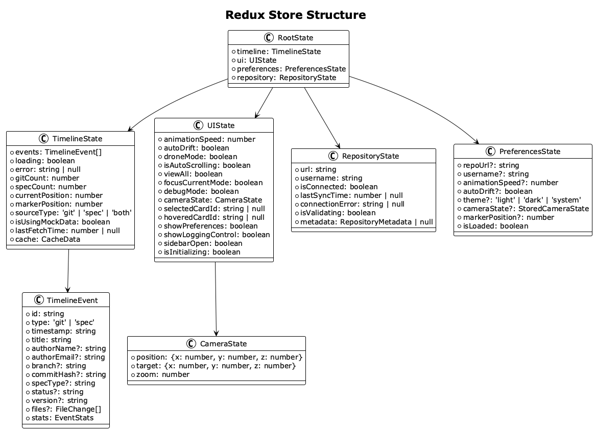

# MVI (Model-View-Intent) Architecture

## Overview

The Timeline Visualization application implements the **MVI (Model-View-Intent)** architectural pattern with **Redux Toolkit** for state management. This pattern provides a unidirectional data flow, predictable state updates, and excellent separation of concerns.

## MVI Pattern Components


### Model Layer (Redux Store)

The Model layer represents the single source of truth for all application state. It consists of multiple Redux slices, each managing a specific domain of the application.



#### Store Configuration

```typescript
// src/store/index.ts
export const store = configureStore({
  reducer: {
    timeline: timelineSlice,
    ui: uiSlice,
    preferences: preferencesSlice,
    repository: repositorySlice,
  },
  middleware: (getDefaultMiddleware) =>
    getDefaultMiddleware({
      serializableCheck: false, // Disabled for Three.js objects
    }),
});
```

#### State Slices

**Timeline Slice** (`src/store/slices/timelineSlice.ts`)
- Manages timeline events, loading states, and data caching
- Handles git and spec history data
- Tracks marker position and timeline state

**UI Slice** (`src/store/slices/uiSlice.ts`)
- Controls animation settings and camera state
- Manages card selection and hover states
- Handles view modes (drone, view-all, focus)

**Repository Slice** (`src/store/slices/repositorySlice.ts`)
- Manages repository connection and metadata
- Tracks validation and sync states
- Handles connection errors

**Preferences Slice** (`src/store/slices/preferencesSlice.ts`)
- Persists user preferences to localStorage
- Manages theme, animation, and camera settings
- Provides preference migration support

### View Layer (React Components)

The View layer consists of pure React components that receive state via props and render the user interface. Components are organized into logical groups:

#### Layout Components
- **MainLayoutRedux**: Primary layout with Redux integration
- **TopBar**: Navigation and repository controls
- **BottomBar**: Status display and animation controls

#### 3D Components
- **TimelineScene**: Three.js canvas and scene setup
- **TimelineCamera**: Camera control and positioning
- **TimelineCard**: Individual timeline event cards
- **TimelineAxis**: Timeline axis and marker

#### UI Components
- **PreferencesModal**: Settings and configuration
- **LoggingControl**: Debug logging interface
- **SpeedControl**: Animation speed adjustment

### Intent Layer (Action Creators & Thunks)

The Intent layer captures user interactions and translates them into actionable intents. It uses Redux Toolkit's `createAsyncThunk` for complex async operations.

#### UI Intents (`src/store/intents/uiIntents.ts`)

```typescript
// Select a card and update camera
export const selectCard = createAsyncThunk<
  void,
  { cardId: string | null; position?: Vector3 },
  { state: RootState }
>(
  'ui/selectCard',
  async ({ cardId, position }, { dispatch }) => {
    dispatch(setSelectedCardId(cardId));
    if (position) {
      dispatch(updateCameraState({ target: position }));
    }
  }
);

// Update timeline position with camera sync
export const updateTimelinePosition = createAsyncThunk<
  void,
  { position: number; updateCamera?: boolean },
  { state: RootState }
>(
  'ui/updateTimelinePosition',
  async ({ position, updateCamera = true }, { dispatch, getState }) => {
    dispatch(setMarkerPosition(position));

    if (updateCamera) {
      const state = getState();
      const currentCamera = state.ui.cameraState;
      dispatch(updateCameraState({
        target: { x: currentCamera.target.x, y: currentCamera.target.y, z: position },
      }));
    }

    dispatch(updateMarkerPositionPreferences(position));
  }
);
```

#### Timeline Intents (`src/store/intents/timelineIntents.ts`)

```typescript
// Fetch timeline data with caching
export const fetchTimelineData = createAsyncThunk<
  TimelineEvent[],
  { repoUrl: string; sourceType: 'git' | 'spec' | 'both'; useMockData?: boolean },
  { state: RootState }
>(
  'timeline/fetchData',
  async ({ repoUrl, sourceType, useMockData = false }, { dispatch, getState }) => {
    dispatch(setLoading(true));
    dispatch(setIsUsingMockData(useMockData));

    try {
      // Fetch data from API or cache
      const events = await fetchTimelineEvents(repoUrl, sourceType);
      dispatch(setEvents(events));
      return events;
    } catch (error) {
      dispatch(setError(error.message));
      throw error;
    }
  }
);
```

## Data Flow


### Sequence Diagram: Card Selection


### Unidirectional Data Flow

1. **User Interaction**: User clicks, hovers, or performs keyboard actions
2. **Intent Dispatch**: Component dispatches an intent (action creator or thunk)
3. **Side Effects**: Async thunks handle API calls, animations, and complex logic
4. **State Update**: Reducers update state immutably
5. **View Update**: Components re-render based on new state
6. **UI Reflection**: Changes are reflected in the user interface

### Example Flow: Card Selection

```typescript
// 1. User clicks on a timeline card
const handleCardClick = (cardId: string, position: Vector3) => {
  // 2. Dispatch intent
  dispatch(selectCard({ cardId, position }));
};

// 3. Intent processes the action
export const selectCard = createAsyncThunk(
  'ui/selectCard',
  async ({ cardId, position }, { dispatch }) => {
    // 4. Update multiple state slices
    dispatch(setSelectedCardId(cardId));
    dispatch(updateCameraState({ target: position }));
  }
);

// 5. Components re-render with new state
const selectedCardId = useAppSelector(state => state.ui.selectedCardId);
const cameraState = useAppSelector(state => state.ui.cameraState);
```

## Benefits of MVI Architecture

### Predictable State Management
- **Single Source of Truth**: All state lives in the Redux store
- **Immutable Updates**: State changes are predictable and traceable
- **Time Travel Debugging**: Redux DevTools enable state inspection

### Separation of Concerns
- **Pure Components**: Views only render based on props
- **Business Logic Isolation**: Complex logic lives in intent layer
- **Testable Code**: Each layer can be tested independently

### Developer Experience
- **Type Safety**: Full TypeScript integration
- **Hot Reloading**: State persists across code changes
- **Debugging Tools**: Comprehensive logging and DevTools

### Performance Optimization
- **Selective Re-rendering**: Components only update when relevant state changes
- **Memoization**: Strategic use of React.memo and useMemo
- **Batched Updates**: Multiple state changes are batched automatically

## Integration with React Components


### Connecting Components to Store

```typescript
// Using typed hooks for type safety
import { useAppDispatch, useAppSelector } from '../store';

const TimelineVisualization: React.FC = () => {
  const dispatch = useAppDispatch();

  // Select state from store
  const {
    events,
    loading,
    markerPosition,
  } = useAppSelector(state => state.timeline);

  const {
    selectedCardId,
    cameraState,
    droneMode,
  } = useAppSelector(state => state.ui);

  // Dispatch intents
  const handleCardSelect = useCallback((cardId: string, position: Vector3) => {
    dispatch(selectCard({ cardId, position }));
  }, [dispatch]);

  const handleMarkerMove = useCallback((position: number) => {
    dispatch(updateTimelinePosition({ position }));
  }, [dispatch]);

  return (
    <TimelineScene
      events={events}
      selectedCardId={selectedCardId}
      cameraState={cameraState}
      onCardSelect={handleCardSelect}
      onMarkerMove={handleMarkerMove}
    />
  );
};
```

### State Persistence

The application automatically persists critical state to localStorage:

```typescript
// Preferences are automatically saved
const preferencesSlice = createSlice({
  name: 'preferences',
  initialState: loadPreferences(),
  reducers: {
    updatePreferences: (state, action) => {
      Object.assign(state, action.payload);
      savePreferences(state); // Auto-save to localStorage
    },
  },
});
```

## Best Practices

### Intent Design
- **Single Responsibility**: Each intent should handle one specific user action
- **Async Handling**: Use createAsyncThunk for operations with side effects
- **Error Handling**: Always handle both success and error cases

### State Shape
- **Normalized Data**: Keep state flat and normalized
- **Derived State**: Calculate derived values in selectors, not reducers
- **Immutable Updates**: Use Redux Toolkit's Immer integration

### Component Integration
- **Minimal State Selection**: Only select the state you need
- **Memoized Callbacks**: Use useCallback for event handlers
- **Type Safety**: Always use typed hooks and selectors

This MVI architecture provides a robust foundation for the Timeline Visualization application, ensuring maintainable, testable, and performant code.
