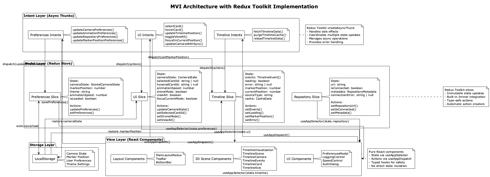
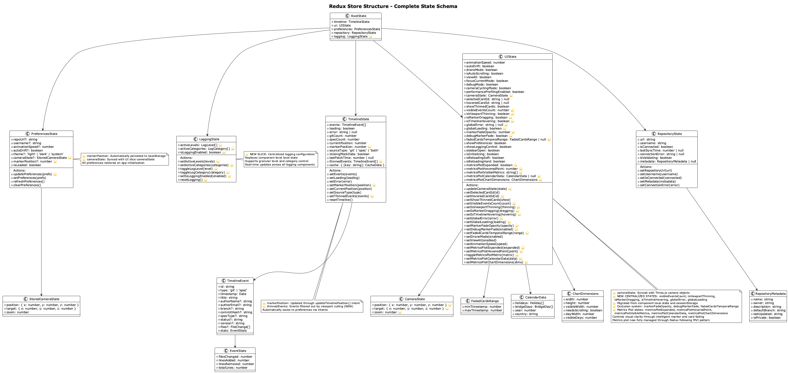
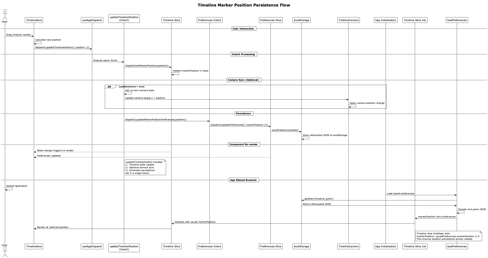

# MVI (Model-View-Intent) Architecture

## Overview

The Timeline Visualization application implements the **MVI (Model-View-Intent)** architectural pattern with **Redux Toolkit** for state management. This pattern provides a unidirectional data flow, predictable state updates, and excellent separation of concerns.

The current implementation fully embraces modern Redux patterns with automatic state persistence, ensuring that camera positions, timeline marker positions, and user preferences are seamlessly preserved across application reloads.

## MVI Pattern Components



### Model Layer (Redux Store)

The Model layer represents the single source of truth for all application state. It consists of four Redux slices, each managing a specific domain with automatic persistence capabilities.



#### Store Configuration

```typescript
// src/store/index.ts
export const store = configureStore({
  reducer: {
    timeline: timelineSlice,
    ui: uiSlice,
    preferences: preferencesSlice,
    repository: repositorySlice,
  },
  middleware: (getDefaultMiddleware) =>
    getDefaultMiddleware({
      serializableCheck: false, // Disabled for Three.js objects
    }),
});

// Typed hooks for better TypeScript integration
export const useAppDispatch = () => useDispatch<AppDispatch>();
export const useAppSelector: TypedUseSelectorHook<RootState> = useSelector;
```

#### State Slices

**Timeline Slice** (`src/store/slices/timelineSlice.ts`)
- Manages timeline events, loading states, and data caching
- Handles git and spec history data
- **Tracks marker position with automatic persistence restoration**
- **Initializes markerPosition from localStorage on app startup**

```typescript
// Load saved preferences to restore marker position
const savedPreferences = loadPreferences();

const initialState: TimelineState = {
  events: [],
  loading: false,
  error: null,
  gitCount: 0,
  specCount: 0,
  currentPosition: savedPreferences.markerPosition || 0,
  markerPosition: savedPreferences.markerPosition || 0, // ⭐ Restored from storage
  sourceType: 'both',
  isUsingMockData: false,
  lastFetchTime: null,
  cache: {},
};
```

**UI Slice** (`src/store/slices/uiSlice.ts`)
- Controls animation settings and **camera state with Three.js synchronization**
- Manages card selection and hover states with exclusive interaction system
- Handles view modes (drone, view-all, focus) with automatic mode coordination
- **Camera state automatically synced with preferences for persistence**
- **Occlusion system state management** for timeline marker and card fading
- **Temporal range tracking** for advanced visual clarity features

**Repository Slice** (`src/store/slices/repositorySlice.ts`)
- Manages repository connection and metadata
- Tracks validation and sync states
- Handles connection errors with automatic retry mechanisms

**Preferences Slice** (`src/store/slices/preferencesSlice.ts`)
- **Automatically persists user preferences to localStorage**
- Manages theme, animation, and **camera settings with real-time sync**
- **Includes marker position persistence for seamless app reloads**
- Provides preference migration support for version compatibility

```typescript
const preferencesSlice = createSlice({
  name: 'preferences',
  initialState: loadPreferences(), // ⭐ Auto-load on initialization
  reducers: {
    updatePreferences: (state, action) => {
      Object.assign(state, action.payload);
      const { isLoaded: _, ...prefs } = state;
      savePreferences(prefs); // ⭐ Auto-save on every update
    },
  },
});
```

### View Layer (React Components)

The View layer consists of pure React components that receive state via props and render the user interface. Components are organized into logical groups with clear Redux integration patterns:

#### Layout Components
- **MainLayoutRedux**: Primary layout with comprehensive Redux integration
- **TopBar**: Navigation and repository controls with real-time state updates
- **BottomBar**: Status display and animation controls with live preference sync

#### 3D Components
- **TimelineScene**: Three.js canvas and scene setup with global interaction coordination
- **TimelineCamera**: **Advanced camera control with automatic state persistence**
- **TimelineCard**: Individual timeline event cards with exclusive interaction system
- **TimelineAxis**: **Timeline axis and marker with persistent position tracking**

#### UI Components
- **PreferencesModal**: Settings and configuration with auto-save capabilities
- **LoggingControl**: Debug logging interface with real-time category control
- **SpeedControl**: Animation speed adjustment with immediate preference persistence

### Intent Layer (Action Creators & Thunks)

The Intent layer captures user interactions and translates them into actionable intents. It uses Redux Toolkit's `createAsyncThunk` for complex async operations and **automatic state persistence coordination**.

#### UI Intents (`src/store/intents/uiIntents.ts`)

**Card Hover Intent with Occlusion System Activation:**
```typescript
export const hoverCard = createAsyncThunk<
  void,
  string | null,
  { state: RootState }
>(
  'ui/hoverCard',
  async (cardId, { dispatch }) => {
    // Update hover state
    dispatch(setHoveredCardId(cardId));
    
    // Occlusion system automatically calculates fade states
    // based on hovered card and updates temporal ranges
    // for marker fading coordination
  }
);
```

**Enhanced Card Selection with Camera Coordination:**
```typescript
export const selectCard = createAsyncThunk<
  void,
  { cardId: string | null; position?: { x: number; y: number; z: number } },
  { state: RootState }
>(
  'ui/selectCard',
  async ({ cardId, position }, { dispatch }) => {
    dispatch(setSelectedCardId(cardId));
    
    if (position) {
      // Coordinate camera movement with card selection
      dispatch(updateCameraState({
        target: position,
      }));
    }
  }
);
```

**Timeline Position Update with Automatic Persistence:**
```typescript
export const updateTimelinePosition = createAsyncThunk<
  void,
  { position: number; updateCamera?: boolean },
  { state: RootState }
>(
  'ui/updateTimelinePosition',
  async ({ position, updateCamera = true }, { dispatch, getState }) => {
    // Update timeline state
    dispatch(setMarkerPosition(position));

    // Optional camera synchronization
    if (updateCamera) {
      const state = getState();
      const currentCamera = state.ui.cameraState;
      dispatch(updateCameraState({
        target: { x: currentCamera.target.x, y: currentCamera.target.y, z: position },
      }));
    }

    // ⭐ Automatic persistence - marker position saved to localStorage
    dispatch(updateMarkerPositionPreferences(position));
  }
);
```

**Camera State with Automatic Persistence:**
```typescript
export const updateCameraWithSync = createAsyncThunk<
  void,
  { position?: { x: number; y: number; z: number }; target?: { x: number; y: number; z: number }; zoom?: number },
  { state: RootState }
>(
  'ui/updateCameraWithSync',
  async (cameraUpdate, { dispatch, getState }) => {
    const state = getState();
    const currentCamera = state.ui.cameraState;

    const newPosition = cameraUpdate.position || currentCamera.position;
    const newTarget = cameraUpdate.target || currentCamera.target;
    const newZoom = cameraUpdate.zoom !== undefined ? cameraUpdate.zoom : currentCamera.zoom;

    // Update UI state
    dispatch(updateCameraState({
      position: newPosition,
      target: newTarget,
      zoom: newZoom,
    }));

    // ⭐ Automatic persistence - camera state saved to localStorage
    dispatch(updateCameraPreferences({
      position: new THREE.Vector3(newPosition.x, newPosition.y, newPosition.z),
      target: new THREE.Vector3(newTarget.x, newTarget.y, newTarget.z),
      zoom: newZoom,
    }));
  }
);
```

#### Preferences Intents (`src/store/intents/preferencesIntents.ts`)

**Automatic Marker Position Persistence:**
```typescript
export const updateMarkerPositionPreferences = createAsyncThunk<
  void,
  number,
  { state: RootState }
>(
  'preferences/updateMarkerPosition',
  async (markerPosition, { dispatch }) => {
    // Automatically save marker position to localStorage
    dispatch(updatePreferences({ markerPosition }));
  }
);
```

**Camera State Persistence:**
```typescript
export const updateCameraPreferences = createAsyncThunk<
  void,
  { position: THREE.Vector3; target: THREE.Vector3; zoom: number },
  { state: RootState }
>(
  'preferences/updateCamera',
  async ({ position, target, zoom }, { dispatch }) => {
    const cameraState: StoredCameraState = {
      position: { x: position.x, y: position.y, z: position.z },
      target: { x: target.x, y: target.y, z: target.z },
      zoom,
    };
    
    // Automatically save camera state to localStorage
    dispatch(updatePreferences({ cameraState }));
  }
);
```

### Occlusion System State Management

The occlusion system adds sophisticated visual clarity features through Redux state management:

```typescript
// UI Slice - Occlusion State
interface UIState {
  // ... existing state
  
  // Occlusion system state
  markerFadeOpacity: number;                    // Current opacity for faded markers
  debugMarkerFade: boolean;                     // Debug visualization toggle  
  fadedCardsTemporalRange: {                    // Timestamp range of faded cards
    minTimestamp: number;
    maxTimestamp: number;
  } | null;
}

// Occlusion state actions
const uiSlice = createSlice({
  name: 'ui',
  initialState,
  reducers: {
    setMarkerFadeOpacity: (state, action: PayloadAction<number>) => {
      state.markerFadeOpacity = action.payload;
    },
    setDebugMarkerFade: (state, action: PayloadAction<boolean>) => {
      state.debugMarkerFade = action.payload;
    },
    setFadedCardsTemporalRange: (state, action: PayloadAction<{ minTimestamp: number; maxTimestamp: number } | null>) => {
      state.fadedCardsTemporalRange = action.payload;
    },
  },
});
```

**Occlusion Calculation Flow:**
1. **Card Hover**: User hovers over timeline card, triggering `hoverCard` intent
2. **Fade Calculation**: `TimelineEvents` component calculates which cards should fade
3. **Temporal Range**: Extract timestamp range of all faded cards
4. **Marker Coordination**: Update Redux state with fade opacity and temporal range
5. **Individual Marker Logic**: Each marker checks if it falls within temporal range
6. **Synchronized Fading**: Cards, text, and markers fade with consistent opacity

## Data Flow with Persistence


### Sequence Diagram: Marker Position Persistence



### Unidirectional Data Flow with Automatic Persistence

1. **User Interaction**: User clicks, drags, or performs actions (marker drag, camera movement)
2. **Intent Dispatch**: Component dispatches an intent (updateTimelinePosition, updateCameraWithSync)
3. **State Update**: Reducers update state immutably in multiple slices
4. **Automatic Persistence**: Intent layer automatically saves critical state to localStorage
5. **View Update**: Components re-render based on new state
6. **UI Reflection**: Changes are reflected in the user interface
7. **Persistence Restoration**: On app reload, state is automatically restored from localStorage

### Example Flow: Timeline Marker with Persistence

```typescript
// 1. User drags timeline marker
const handleMarkerDrag = (newPosition: number) => {
  // 2. Dispatch intent with automatic persistence
  dispatch(updateTimelinePosition({ position: newPosition }));
};

// 3. Intent processes the action with multiple updates
export const updateTimelinePosition = createAsyncThunk(
  'ui/updateTimelinePosition',
  async ({ position }, { dispatch }) => {
    // 4. Update timeline state
    dispatch(setMarkerPosition(position));
    
    // 5. Update camera if needed
    dispatch(updateCameraState({ target: { z: position }}));
    
    // 6. ⭐ Automatic persistence to localStorage
    dispatch(updateMarkerPositionPreferences(position));
  }
);

// 7. Components re-render with new state
const markerPosition = useAppSelector(state => state.timeline.markerPosition);
const cameraState = useAppSelector(state => state.ui.cameraState);

// 8. On app reload - automatic restoration
const initialState: TimelineState = {
  markerPosition: loadPreferences().markerPosition || 0, // ⭐ Restored
  // ... other state
};
```

## Benefits of MVI Architecture with Persistence

### Predictable State Management
- **Single Source of Truth**: All state lives in the Redux store
- **Immutable Updates**: State changes are predictable and traceable
- **Time Travel Debugging**: Redux DevTools enable state inspection
- **Automatic Persistence**: Critical state automatically preserved across reloads

### Separation of Concerns
- **Pure Components**: Views only render based on props from Redux state
- **Business Logic Isolation**: Complex logic lives in intent layer with persistence handling
- **Testable Code**: Each layer can be tested independently
- **Persistence Abstraction**: Storage logic centralized in intent and preference layers

### Developer Experience
- **Type Safety**: Full TypeScript integration with typed hooks
- **Hot Reloading**: State persists across code changes
- **Debugging Tools**: Comprehensive logging and DevTools integration
- **Seamless UX**: Users always return to their exact previous state

### Performance Optimization
- **Selective Re-rendering**: Components only update when relevant state changes
- **Memoization**: Strategic use of React.memo and useMemo
- **Batched Updates**: Multiple state changes are batched automatically
- **Efficient Persistence**: Only changed preferences are persisted

## Integration with React Components


### Connecting Components to Store with Persistence

```typescript
// Using typed hooks for type safety and automatic persistence
import { useAppDispatch, useAppSelector } from '../store';

const TimelineVisualization: React.FC = () => {
  const dispatch = useAppDispatch();

  // Select state from store (automatically restored from localStorage)
  const {
    events,
    loading,
    markerPosition, // ⭐ Automatically restored on app load
  } = useAppSelector(state => state.timeline);

  const {
    selectedCardId,
    cameraState, // ⭐ Automatically restored on app load
    droneMode,
  } = useAppSelector(state => state.ui);

  // Dispatch intents with automatic persistence
  const handleCardSelect = useCallback((cardId: string, position: Vector3) => {
    // Card selection automatically coordinates camera movement
    dispatch(selectCard({ cardId, position }));
  }, [dispatch]);

  const handleMarkerMove = useCallback((position: number) => {
    // Marker position automatically persisted to localStorage
    dispatch(updateTimelinePosition({ position }));
  }, [dispatch]);

  const handleCameraChange = useCallback((state: CameraState) => {
    // Camera state automatically persisted to localStorage
    dispatch(updateCameraWithSync({
      position: { x: state.position.x, y: state.position.y, z: state.position.z },
      target: { x: state.target.x, y: state.target.y, z: state.target.z },
      zoom: state.zoom
    }));
  }, [dispatch]);

  return (
    <TimelineScene
      events={events}
      selectedCardId={selectedCardId}
      cameraState={cameraState}
      markerPosition={markerPosition}
      onCardSelect={handleCardSelect}
      onMarkerMove={handleMarkerMove}
      onCameraChange={handleCameraChange}
    />
  );
};
```

### State Persistence Architecture

The application automatically persists critical state to localStorage through the preferences system:

```typescript
// Storage interface with type safety
export type StoredCameraState = {
  position: { x: number; y: number; z: number };
  target: { x: number; y: number; z: number };
  zoom: number;
};

export type Preferences = {
  repoUrl?: string;
  username?: string;
  animationSpeed?: number;
  autoDrift?: boolean;
  theme?: 'light' | 'dark' | 'system';
  cameraState?: StoredCameraState; // ⭐ Camera persistence
  markerPosition?: number; // ⭐ Marker persistence
}

// Automatic persistence on every preference update
const preferencesSlice = createSlice({
  name: 'preferences',
  initialState: loadPreferences(), // ⭐ Auto-restore on startup
  reducers: {
    updatePreferences: (state, action) => {
      Object.assign(state, action.payload);
      const { isLoaded: _, ...prefs } = state;
      savePreferences(prefs); // ⭐ Auto-save to localStorage
    },
  },
});
```

## Best Practices

### Intent Design
- **Single Responsibility**: Each intent should handle one specific user action
- **Async Handling**: Use createAsyncThunk for operations with side effects
- **Error Handling**: Always handle both success and error cases
- **Automatic Persistence**: Use preference intents for state that should persist

### State Shape
- **Normalized Data**: Keep state flat and normalized
- **Derived State**: Calculate derived values in selectors, not reducers
- **Immutable Updates**: Use Redux Toolkit's Immer integration
- **Persistence Coordination**: Use intents to coordinate state and persistence updates

### Component Integration
- **Minimal State Selection**: Only select the state you need
- **Memoized Callbacks**: Use useCallback for event handlers
- **Type Safety**: Always use typed hooks and selectors
- **Persistence Awareness**: Use intents (not direct actions) for persistable state changes

### Persistence Patterns
- **Intent-Driven Persistence**: Always persist through intent layer, not directly in components
- **Automatic Restoration**: Initialize slices with loadPreferences() for seamless restoration
- **Type-Safe Storage**: Use defined interfaces for all persisted data
- **Graceful Degradation**: Always provide defaults when persistence data is unavailable

This MVI architecture with automatic persistence provides a robust foundation for the Timeline Visualization application, ensuring maintainable, testable, performant code with an excellent user experience that preserves state across application reloads.