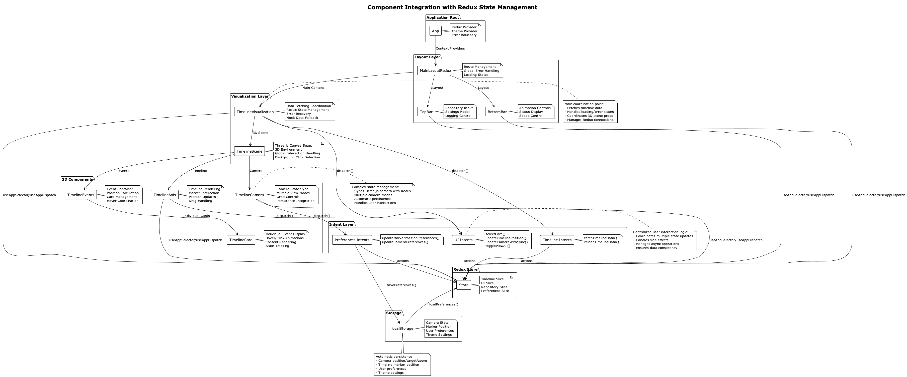

# Redux State Management Guide

## Overview

The Timeline Visualization application uses **Redux Toolkit** for centralized state management, following modern Redux patterns and best practices with **automatic state persistence**. This guide covers the complete state management architecture, including store configuration, slices, actions, and integration patterns that ensure seamless user experience across application reloads.

## Store Configuration

### Root Store Setup

```typescript
// src/store/index.ts
import { configureStore } from '@reduxjs/toolkit';
import { useDispatch, useSelector, TypedUseSelectorHook } from 'react-redux';

import timelineSlice from './slices/timelineSlice';
import uiSlice from './slices/uiSlice';
import preferencesSlice from './slices/preferencesSlice';
import repositorySlice from './slices/repositorySlice';

export const store = configureStore({
  reducer: {
    timeline: timelineSlice,
    ui: uiSlice,
    preferences: preferencesSlice,
    repository: repositorySlice,
  },
  middleware: (getDefaultMiddleware) =>
    getDefaultMiddleware({
      serializableCheck: false, // Disabled for Three.js Vector3 objects
    }),
});

export type RootState = ReturnType<typeof store.getState>;
export type AppDispatch = typeof store.dispatch;

// Typed hooks for better TypeScript integration
export const useAppDispatch = () => useDispatch<AppDispatch>();
export const useAppSelector: TypedUseSelectorHook<RootState> = useSelector;
```

### Middleware Configuration

The store uses Redux Toolkit's default middleware with customizations:

- **Redux Thunk**: For async actions and side effects
- **Immutability Check**: Ensures state immutability (development only)
- **Serializable Check**: Disabled to allow Three.js objects in state
- **Action Creator Check**: Validates action creators (development only)

## State Slices


### Timeline Slice

**File**: `src/store/slices/timelineSlice.ts`

**Purpose**: Manages timeline events, loading states, and **marker position with automatic persistence**.

```typescript
import { createSlice, PayloadAction } from '@reduxjs/toolkit';
import type { TimelineEvent } from '../../data/types/TimelineEvent';
import { loadPreferences } from '../../services/storage'; // ⭐ Persistence integration

interface TimelineState {
  events: TimelineEvent[];
  loading: boolean;
  error: string | null;
  gitCount: number;
  specCount: number;
  currentPosition: number;
  markerPosition: number; // ⭐ Persisted to localStorage
  sourceType: 'git' | 'spec' | 'both';
  isUsingMockData: boolean;
  lastFetchTime: number | null;
  cache: { [key: string]: CacheData };
}

// ⭐ Load saved preferences to restore marker position
const savedPreferences = loadPreferences();

const initialState: TimelineState = {
  events: [],
  loading: false,
  error: null,
  gitCount: 0,
  specCount: 0,
  currentPosition: savedPreferences.markerPosition || 0,
  markerPosition: savedPreferences.markerPosition || 0, // ⭐ Restored from storage
  sourceType: 'both',
  isUsingMockData: false,
  lastFetchTime: null,
  cache: {},
};

const timelineSlice = createSlice({
  name: 'timeline',
  initialState,
  reducers: {
    setEvents: (state, action: PayloadAction<TimelineEvent[]>) => {
      state.events = action.payload;
      state.gitCount = action.payload.filter(e => e.type === 'git').length;
      state.specCount = action.payload.filter(e => e.type === 'spec').length;
      state.loading = false;
      state.error = null;
      state.lastFetchTime = Date.now();
    },
    setMarkerPosition: (state, action: PayloadAction<number>) => {
      state.markerPosition = action.payload; // ⭐ Updated through intents for persistence
    },
    // ... other reducers
  },
});
```

**Key Features**:

- **Automatic Restoration**: Initializes `markerPosition` from localStorage
- **Cache Management**: Handles data caching for performance
- **Mock Data Support**: Seamless fallback to mock data
- **Event Statistics**: Tracks git and spec event counts

### UI Slice

**File**: `src/store/slices/uiSlice.ts`

**Purpose**: Controls user interface state including **camera state with Three.js synchronization**.

```typescript
interface UIState {
  animationSpeed: number;
  autoDrift: boolean;
  droneMode: boolean;
  isAutoScrolling: boolean;
  viewAll: boolean;
  focusCurrentMode: boolean;
  debugMode: boolean;
  cameraState: CameraState; // ⭐ Synced with Three.js camera and persisted
  selectedCardId: string | null;
  hoveredCardId: string | null;
  showPreferences: boolean;
  showLoggingControl: boolean;
  sidebarOpen: boolean;
  isInitializing: boolean;
}

interface CameraState {
  position: { x: number; y: number; z: number }; // ⭐ Persisted across reloads
  target: { x: number; y: number; z: number };   // ⭐ Persisted across reloads
  zoom: number;                                  // ⭐ Persisted across reloads
}

const uiSlice = createSlice({
  name: 'ui',
  initialState,
  reducers: {
    updateCameraState: (state, action: PayloadAction<Partial<CameraState>>) => {
      // ⭐ Updates camera state - synced with persistence through intents
      state.cameraState = { ...state.cameraState, ...action.payload };
    },
    setSelectedCardId: (state, action: PayloadAction<string | null>) => {
      state.selectedCardId = action.payload;
    },
    setDroneMode: (state, action: PayloadAction<boolean>) => {
      state.droneMode = action.payload;
      if (action.payload) {
        // Auto-enable scrolling for drone mode
        state.isAutoScrolling = true;
      }
    },
    // ... other reducers
  },
});
```

**Key Features**:

- **Camera State Management**: Coordinates between Three.js objects and Redux state
- **View Mode Coordination**: Manages multiple camera modes (drone, view-all, focus)
- **Interaction State**: Tracks card selection and hover states
- **Animation Control**: Manages auto-drift and animation speed

### Repository Slice

**File**: `src/store/slices/repositorySlice.ts`

**Purpose**: Manages repository connection, validation, and metadata.

```typescript
interface RepositoryState {
  url: string;
  username: string;
  isConnected: boolean;
  lastSyncTime: number | null;
  connectionError: string | null;
  isValidating: boolean;
  metadata: RepositoryMetadata | null;
}

const repositorySlice = createSlice({
  name: 'repository',
  initialState,
  reducers: {
    setRepositoryUrl: (state, action: PayloadAction<string>) => {
      state.url = action.payload;
      state.isConnected = false;
      state.connectionError = null;
    },
    setIsConnected: (state, action: PayloadAction<boolean>) => {
      state.isConnected = action.payload;
      if (action.payload) {
        state.lastSyncTime = Date.now();
        state.connectionError = null;
      }
    },
    // ... other reducers
  },
});
```

**Key Features**:

- **Connection Management**: Tracks repository connectivity status
- **Validation Handling**: Manages repository URL validation
- **Error Recovery**: Handles connection errors and retry logic
- **Metadata Storage**: Stores repository information

### Preferences Slice

**File**: `src/store/slices/preferencesSlice.ts`

**Purpose**: **Automatically persists user preferences to localStorage** with real-time synchronization.

```typescript
import { createSlice, PayloadAction } from '@reduxjs/toolkit';
import { loadPreferences, savePreferences, type Preferences } from '../../services/storage';

interface PreferencesState extends Preferences {
  isLoaded: boolean;
}

const initialState: PreferencesState = {
  ...loadPreferences(), // ⭐ Auto-load preferences on startup
  isLoaded: true,
};

const preferencesSlice = createSlice({
  name: 'preferences',
  initialState,
  reducers: {
    updatePreferences: (state, action: PayloadAction<Partial<Preferences>>) => {
      Object.assign(state, action.payload);
      const { isLoaded: _, ...prefs } = state;
      savePreferences(prefs); // ⭐ Auto-save to localStorage on every update
    },
    setPreferences: (state, action: PayloadAction<Preferences>) => {
      const { isLoaded } = state;
      Object.assign(state, action.payload, { isLoaded });
      const { isLoaded: __, ...prefs } = state;
      savePreferences(prefs); // ⭐ Auto-save to localStorage
    },
    refreshPreferences: (state) => {
      const loaded = loadPreferences();
      Object.assign(state, loaded, { isLoaded: true });
    },
  },
});
```

**Persistence Interface**:

```typescript
// src/services/storage.ts
export type StoredCameraState = {
  position: { x: number; y: number; z: number };
  target: { x: number; y: number; z: number };
  zoom: number;
};

export type Preferences = {
  repoUrl?: string;
  username?: string;
  animationSpeed?: number;
  autoDrift?: boolean;
  theme?: 'light' | 'dark' | 'system';
  cameraState?: StoredCameraState; // ⭐ Camera persistence
  markerPosition?: number;         // ⭐ Marker persistence
}

function savePreferences(prefs: Preferences) {
  const data = encode(JSON.stringify(prefs));
  localStorage.setItem(STORAGE_KEY, data); // ⭐ Obfuscated storage
}

function loadPreferences(): Preferences {
  const data = localStorage.getItem(STORAGE_KEY);
  if (!data) return {};
  try {
    return JSON.parse(decode(data));
  } catch {
    return {};
  }
}
```

**Key Features**:

- **Automatic Persistence**: Every preference update is immediately saved
- **Obfuscated Storage**: Preferences are encoded before storage
- **Type Safety**: Full TypeScript interfaces for all stored data
- **Migration Support**: Graceful handling of missing or invalid preferences

## Intent Layer (Async Thunks)

The intent layer coordinates complex user interactions with **automatic state persistence**.

### UI Intents

**File**: `src/store/intents/uiIntents.ts`

```typescript
// Timeline position update with automatic persistence
export const updateTimelinePosition = createAsyncThunk<
  void,
  { position: number; updateCamera?: boolean },
  { state: RootState }
>(
  'ui/updateTimelinePosition',
  async ({ position, updateCamera = true }, { dispatch, getState }) => {
    // 1. Update timeline state
    dispatch(setMarkerPosition(position));

    // 2. Optional camera synchronization
    if (updateCamera) {
      const state = getState();
      const currentCamera = state.ui.cameraState;
      dispatch(updateCameraState({
        target: { x: currentCamera.target.x, y: currentCamera.target.y, z: position },
      }));
    }

    // 3. ⭐ Automatic persistence - marker position saved to localStorage
    dispatch(updateMarkerPositionPreferences(position));
  }
);

// Camera state update with automatic persistence
export const updateCameraWithSync = createAsyncThunk<
  void,
  { position?: { x: number; y: number; z: number }; target?: { x: number; y: number; z: number }; zoom?: number },
  { state: RootState }
>(
  'ui/updateCameraWithSync',
  async (cameraUpdate, { dispatch, getState }) => {
    const state = getState();
    const currentCamera = state.ui.cameraState;

    const newPosition = cameraUpdate.position || currentCamera.position;
    const newTarget = cameraUpdate.target || currentCamera.target;
    const newZoom = cameraUpdate.zoom !== undefined ? cameraUpdate.zoom : currentCamera.zoom;

    // 1. Update UI state
    dispatch(updateCameraState({
      position: newPosition,
      target: newTarget,
      zoom: newZoom,
    }));

    // 2. ⭐ Automatic persistence - camera state saved to localStorage
    dispatch(updateCameraPreferences({
      position: new THREE.Vector3(newPosition.x, newPosition.y, newPosition.z),
      target: new THREE.Vector3(newTarget.x, newTarget.y, newTarget.z),
      zoom: newZoom,
    }));
  }
);

// Card selection with camera coordination
export const selectCard = createAsyncThunk<
  void,
  { cardId: string | null; position?: { x: number; y: number; z: number } },
  { state: RootState }
>(
  'ui/selectCard',
  async ({ cardId, position }, { dispatch }) => {
    dispatch(setSelectedCardId(cardId));

    if (position) {
      // Coordinate camera movement with card selection
      dispatch(updateCameraState({
        target: position,
      }));
    }
  }
);
```

### Timeline Intents

**File**: `src/store/intents/timelineIntents.ts`

```typescript
// Fetch timeline data with caching and error handling
export const fetchTimelineData = createAsyncThunk<
  TimelineEvent[],
  { repoUrl: string; sourceType: 'git' | 'spec' | 'both'; useMockData?: boolean },
  { state: RootState }
>(
  'timeline/fetchData',
  async ({ repoUrl, sourceType, useMockData = false }, { dispatch, getState }) => {
    dispatch(setLoading(true));
    dispatch(setIsUsingMockData(useMockData));

    try {
      const events = await fetchTimelineEvents(repoUrl, sourceType);
      dispatch(setEvents(events));
      return events;
    } catch (error) {
      dispatch(setError(error.message));
      
      // Automatic fallback to mock data
      if (!useMockData) {
        const mockEvents = await getMockData(sourceType);
        dispatch(setEvents(mockEvents));
        dispatch(setIsUsingMockData(true));
        return mockEvents;
      }
      
      throw error;
    }
  }
);
```

### Preferences Intents

**File**: `src/store/intents/preferencesIntents.ts`

```typescript
// Automatic marker position persistence
export const updateMarkerPositionPreferences = createAsyncThunk<
  void,
  number,
  { state: RootState }
>(
  'preferences/updateMarkerPosition',
  async (markerPosition, { dispatch }) => {
    // ⭐ Automatically save marker position to localStorage
    dispatch(updatePreferences({ markerPosition }));
  }
);

// Camera state persistence with Three.js integration
export const updateCameraPreferences = createAsyncThunk<
  void,
  { position: THREE.Vector3; target: THREE.Vector3; zoom: number },
  { state: RootState }
>(
  'preferences/updateCamera',
  async ({ position, target, zoom }, { dispatch }) => {
    const cameraState: StoredCameraState = {
      position: { x: position.x, y: position.y, z: position.z },
      target: { x: target.x, y: target.y, z: target.z },
      zoom,
    };
    
    // ⭐ Update both UI state and preferences
    dispatch(updatePreferences({ cameraState }));
    dispatch(updateCameraState({ position, target, zoom }));
  }
);
```

## Component Integration Patterns



### Connecting Components with Persistence

```typescript
// TimelineVisualization.tsx - Main orchestrator component
import { useAppDispatch, useAppSelector } from '../store';

const TimelineVisualization: React.FC = () => {
  const dispatch = useAppDispatch();

  // Select state from store (automatically restored from localStorage)
  const {
    events,
    loading,
    markerPosition, // ⭐ Automatically restored on app load
  } = useAppSelector(state => state.timeline);

  const {
    selectedCardId,
    cameraState, // ⭐ Automatically restored on app load
    droneMode,
  } = useAppSelector(state => state.ui);

  // Event handlers with automatic persistence
  const handleMarkerMove = useCallback((position: number) => {
    // ⭐ Marker position automatically persisted through intent
    dispatch(updateTimelinePosition({ position }));
  }, [dispatch]);

  const handleCameraChange = useCallback((state: CameraState) => {
    // ⭐ Camera state automatically persisted through intent
    dispatch(updateCameraWithSync({
      position: { x: state.position.x, y: state.position.y, z: state.position.z },
      target: { x: state.target.x, y: state.target.y, z: state.target.z },
      zoom: state.zoom
    }));
  }, [dispatch]);

  return (
    <TimelineScene
      events={events}
      selectedCardId={selectedCardId}
      cameraState={cameraState}
      markerPosition={markerPosition}
      onMarkerMove={handleMarkerMove}
      onCameraChange={handleCameraChange}
    />
  );
};
```

### Three.js Camera Integration

```typescript
// TimelineCamera.tsx - Camera component with Redux integration
const TimelineCamera: React.FC<TimelineCameraProps> = ({ target }) => {
  const dispatch = useAppDispatch();
  const { cameraState } = useAppSelector(state => state.ui);
  const { camera } = useThree();

  // Apply Redux camera state to Three.js camera
  useEffect(() => {
    camera.position.set(
      cameraState.position.x,
      cameraState.position.y,
      cameraState.position.z
    );
    camera.lookAt(
      cameraState.target.x,
      cameraState.target.y,
      cameraState.target.z
    );
  }, [camera, cameraState]);

  // Handle user camera interactions
  const handleCameraChange = useCallback(() => {
    const newState = {
      position: { x: camera.position.x, y: camera.position.y, z: camera.position.z },
      target: { x: target.x, y: target.y, z: target.z },
      zoom: camera.zoom
    };
    
    // ⭐ Update Redux state and automatically persist
    dispatch(updateCameraWithSync(newState));
  }, [camera, target, dispatch]);

  return (
    <OrbitControls
      onChange={handleCameraChange}
      onEnd={handleCameraChange}
    />
  );
};
```

## Performance Optimization

### Selective State Updates

- **Memoized Selectors**: Use `createSelector` from Redux Toolkit for computed state
- **Component Optimization**: Strategic use of `React.memo` for expensive components
- **Debounced Persistence**: Throttle localStorage writes to prevent excessive I/O

```typescript
// Memoized selector for derived state
const selectSortedEvents = createSelector(
  [state => state.timeline.events],
  (events) => [...events].sort((a, b) => a.timestamp.getTime() - b.timestamp.getTime())
);

// Optimized component with memoization
const TimelineCard = React.memo<TimelineCardProps>(({ event, selected }) => {
  // Component only re-renders when props actually change
  return <div>{/* card content */}</div>;
});
```

### Persistence Optimization

```typescript
// Debounced preference updates to reduce localStorage writes
const debouncedUpdatePreferences = debounce((preferences: Partial<Preferences>) => {
  dispatch(updatePreferences(preferences));
}, 100);
```

## Testing Strategies

### Unit Testing Slices

```typescript
// Timeline slice tests
describe('timelineSlice', () => {
  it('should restore marker position from preferences', () => {
    const mockPreferences = { markerPosition: 42 };
    jest.mocked(loadPreferences).mockReturnValue(mockPreferences);
    
    const state = timelineSlice.reducer(undefined, { type: '@@INIT' });
    expect(state.markerPosition).toBe(42);
  });
});
```

### Integration Testing with Redux

```typescript
// Test intent with persistence
describe('updateTimelinePosition', () => {
  it('should update position and persist to localStorage', async () => {
    const store = mockStore();
    await store.dispatch(updateTimelinePosition({ position: 100 }));
    
    const actions = store.getActions();
    expect(actions).toContainEqual(setMarkerPosition(100));
    expect(actions).toContainEqual(updateMarkerPositionPreferences(100));
  });
});
```

## Best Practices

### State Management

1. **Use Typed Hooks**: Always use `useAppDispatch` and `useAppSelector`
2. **Intent-Driven Updates**: Use intents for complex operations, direct actions for simple updates
3. **Persistence Coordination**: Coordinate state updates with persistence through intents
4. **Error Boundaries**: Wrap components with error boundaries for Redux errors

### Performance

1. **Selective Subscriptions**: Only subscribe to the state you need
2. **Memoization**: Use `useMemo` and `useCallback` for expensive computations
3. **Batched Updates**: Group related state updates in single intents
4. **Persistence Throttling**: Debounce frequent persistence operations

### Development

1. **Redux DevTools**: Use Redux DevTools for debugging state changes
2. **Type Safety**: Maintain strict TypeScript types for all state
3. **Testing**: Write tests for both slices and intents
4. **Documentation**: Document complex state interactions and persistence patterns

This Redux architecture provides a robust foundation for the Timeline Visualization application, ensuring predictable state management with seamless persistence across application reloads.