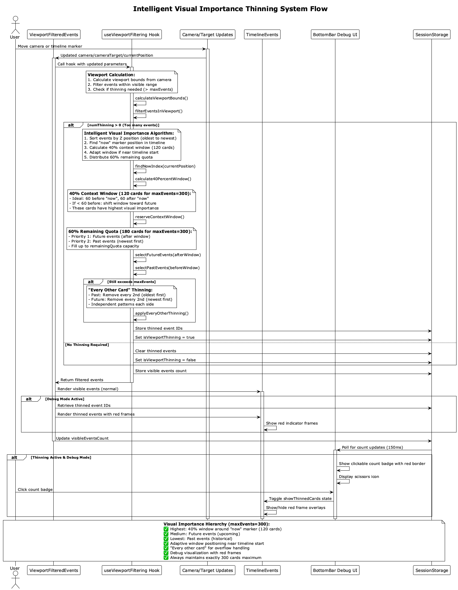
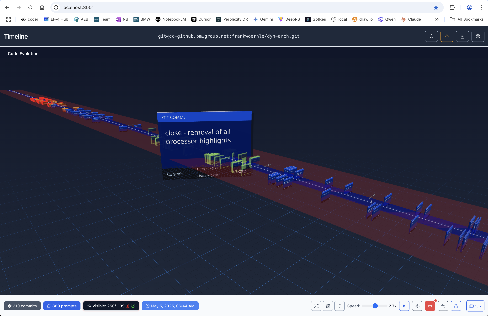

# Viewport Culling System

## Overview

The Timeline Visualization application implements a sophisticated **Balanced Viewport Culling System** to efficiently handle large datasets (800+ timeline events) while maintaining smooth 60fps performance. This system intelligently removes cards from the viewport while preserving visual context and preventing jarring visual jumps.



## Core Algorithm: Intelligent Visual Importance Thinning

### Problem Statement

When displaying large numbers of timeline events (git commits + spec changes), Three.js performance degrades significantly. Simply removing random cards creates visual discontinuity and poor user experience, especially when the timeline marker moves.

### Solution: Visual Importance-Based Thinning

The algorithm implements a sophisticated thinning strategy that preserves visual importance based on temporal relevance to the "now" marker position, ensuring the most contextually important cards remain visible.

### Key Features

#### 1. 40% Context Window Around "Now"

- **Size**: 40% of `maxEvents` (120 cards for maxEvents=300)
- **Ideal Distribution**: 20% before "now", 20% after "now" (60 cards each side)
- **Adaptive Behavior**: If fewer than 60 cards exist before "now", the window shifts toward the future while maintaining as close to 20% before as possible
- **Purpose**: Ensures maximum context around the current timeline position

#### 2. Visual Importance Hierarchy

Cards are prioritized based on their temporal relationship to the "now" marker:

1. **Highest Priority**: Cards within the 40% window around "now"
2. **Medium Priority**: Future cards (after the window) - representing upcoming events
3. **Lowest Priority**: Past cards (before the window) - representing historical events

#### 3. Intelligent Distribution Algorithm

```typescript
// Calculate the 40% window
const windowSize = Math.floor(0.4 * maxEvents); // 120 cards
const idealBeforeNow = Math.floor(0.2 * maxEvents); // 60 cards
const idealAfterNow = windowSize - idealBeforeNow; // 60 cards

// Adaptive window positioning
if (cardsBeforeNow >= idealBeforeNow) {
  windowStart = actualNowIndex - idealBeforeNow;
  windowEnd = actualNowIndex + idealAfterNow;
} else {
  // Shift window toward future when near timeline start
  windowStart = actualNowIndex - cardsBeforeNow;
  windowEnd = actualNowIndex + (windowSize - cardsBeforeNow);
}
```

#### 4. 60% Remaining Quota Distribution

After reserving the 40% window, the remaining 60% of cards (180 for maxEvents=300) are filled:

1. **First Priority**: Future events (after the window) - fill as many as possible
2. **Second Priority**: Past events (before the window) - fill with newest past events first

#### 5. "Every Other Card" Overflow Thinning

When the selected cards still exceed `maxEvents`:

- Removes every 2nd card using independent patterns for each side
- **Past Side**: Starts with oldest cards, works toward the window
- **Future Side**: Starts with newest cards, works toward the window
- Ensures balanced visual distribution without clustering

## Implementation Details

### Hook: `useViewportFiltering`

**Location**: `src/hooks/useViewportFiltering.ts`

**Actual Configuration Used**:
```typescript
// In ViewportFilteredEvents.tsx
{
  paddingFactor: 1.2,        // Small padding to avoid pop-in/out at edges
  minEvents: 0,              // Don't force minimum events
  maxEvents: 300,            // Maximum events to display (overrides hook default of 500)
  updateThrottleMs: 150,     // Update frequency (overrides hook default of 100ms)
  debugMode: props.debugMode,// Enable debug logging and visualization
  windowSize: 110            // Fixed viewport window size (±110 world units)
}
```

### Algorithm Steps

1. **Viewport Calculation**
   - Calculate visible bounds based on camera position and target
   - Apply padding factor for smooth transitions
   - Expand viewport if insufficient events are found

2. **Thinning Decision**

   ```typescript
   const numThinning = eventsInViewport.length - maxEvents;
   if (numThinning > 0) {
     // Trigger intelligent thinning algorithm
   }
   ```

3. **"Now" Marker Position Detection**

   ```typescript
   const nowIndex = sortedByZ.findIndex(ep => ep.z >= nowZ);
   const actualNowIndex = nowIndex === -1 ? sortedByZ.length : nowIndex;
   ```

4. **40% Context Window Calculation**

   ```typescript
   const windowSize = Math.floor(0.4 * maxEvents); // 120 cards
   const idealBeforeNow = Math.floor(0.2 * maxEvents); // 60 cards
   
   // Adaptive window positioning based on available cards
   if (cardsBeforeNow >= idealBeforeNow) {
     windowStart = actualNowIndex - idealBeforeNow;
     windowEnd = actualNowIndex + idealAfterNow;
   } else {
     // Shift window toward future
     windowStart = Math.max(0, actualNowIndex - cardsBeforeNow);
     windowEnd = actualNowIndex + (windowSize - cardsBeforeNow);
   }
   ```

5. **60% Remaining Quota Distribution**

   ```typescript
   const remainingQuota = maxEvents - reservedEvents.length;
   
   // Prioritize future events
   const futureQuota = Math.min(remainingQuota, afterWindow.length);
   selectedAfterWindow = afterWindow.slice(0, futureQuota);
   
   // Fill remaining with newest past events
   const pastQuota = remainingQuota - selectedAfterWindow.length;
   selectedBeforeWindow = beforeWindow.slice(-pastQuota);
   ```

6. **"Every Other Card" Overflow Thinning**

   - Apply when total selected events still exceed `maxEvents`
   - Remove every 2nd card from past (oldest first)
   - Then remove every 2nd card from future (newest first)
   - Independent patterns for each side

## Debug Visualization

### Red Frame Overlays



When debug mode is active and thinning occurs:

1. **Thinned cards** show red frame overlays
2. **BottomBar count badge** displays "Visible: X/Y" with:
   - Red border when thinning is active
   - Scissors icon (✂️) indicator
   - Check mark (✅) when red frames are visible

3. **Interactive Controls**:
   - Click count badge to toggle red frame visibility
   - Red frames only show when explicitly requested (not automatic)
   - State resets when exiting debug mode

### Debug Logging

The system provides comprehensive debug logging when `debugMode: true`:

```typescript
logger.debug('Smart thinning applied', {
  originalCount: eventsInViewport.length,
  finalCount: filtered.length,
  windowSize,
  windowStart,
  windowEnd,
  reservedCount: reservedEvents.length,
  beforeWindowSelected: selectedBeforeWindow.length,
  afterWindowSelected: selectedAfterWindow.length,
  strategy: 'Smart importance-based with now-marker awareness'
});
```

## Performance Impact

### Before Implementation

- **Rendered Objects**: 800+ timeline cards
- **Frame Rate**: 15-30 FPS with stuttering
- **Memory Usage**: Continuously increasing
- **User Experience**: Laggy interactions, poor responsiveness

### After Implementation

- **Rendered Objects**: 300 maximum (75-90% reduction)
- **Frame Rate**: Consistent 60 FPS
- **Memory Usage**: Stable, no leaks
- **User Experience**: Smooth interactions, responsive camera controls

### Key Metrics

- **Viewport Filtering**: 150ms update throttle
- **Context Window**: 120 cards around "now" marker (40% of maxEvents=300)
- **Ideal Distribution**: 60 cards before, 60 cards after "now" (20% each)
- **Remaining Quota**: 180 cards (60% of maxEvents=300)
- **Thinning Threshold**: Triggered when > 300 events in viewport
- **Real-time Updates**: SessionStorage polling every 150ms (matches filtering throttle)

## State Management

### SessionStorage Integration

The system uses SessionStorage for cross-component communication:

```typescript
// Store thinning status
sessionStorage.setItem('isViewportThinning', isThinning.toString());

// Store thinned event IDs
sessionStorage.setItem('thinnedEvents', JSON.stringify(thinnedEventIds));

// Store visible count for UI
sessionStorage.setItem('visibleEventsCount', visibleEvents.length.toString());
```

### Redux Integration

The BottomBar component reads SessionStorage and manages UI state:

```typescript
const showThinnedCards = useAppSelector(state => state.ui.showThinnedCards);
const handleVisibleCountClick = () => {
  if (isThinning) {
    dispatch(setShowThinnedCards(!showThinnedCards));
  }
};
```

## Configuration

### Tunable Parameters

| Parameter | Actual Value | Purpose | Impact |
|-----------|--------------|---------|---------|
| `maxEvents` | 300 | Maximum visible cards | Higher = more context, lower performance |
| `paddingFactor` | 1.2 | Viewport padding multiplier | Higher = smoother transitions, more culling |
| `updateThrottleMs` | 150 | Update frequency | Lower = more responsive, higher CPU usage |
| `windowSize` | 110 | Viewport size (world units) | Fixed optimal size for timeline scale |
| Context Window | 40% of maxEvents (120) | Cards preserved around "now" | Higher = more temporal context |
| Ideal Before/After | 20% each (60 each) | Distribution around "now" | Ensures balanced context |
| Remaining Quota | 60% of maxEvents (180) | Cards for rest of timeline | Prioritizes future over past |

### Environment Considerations

- **Development**: Enable debug mode for visualization and logging
- **Production**: Disable debug mode for optimal performance
- **Large Datasets**: Consider increasing `maxEvents` if performance allows
- **Low-End Devices**: Decrease `maxEvents` and increase `updateThrottleMs`

## Future Enhancements

### Potential Improvements

1. **Adaptive Culling**: Adjust `maxEvents` based on device performance
2. **Configurable Context Window**: Allow users to adjust the 40/60 split
3. **Milestone Preservation**: Never cull major releases or tagged commits
4. **LOD System**: Different detail levels for distant cards
5. **Predictive Loading**: Pre-load cards in camera movement direction
6. **Importance Scoring**: Weight cards by commit size, author, or impact

### Performance Monitoring

Monitor these metrics to assess culling effectiveness:

- Frame rate during camera movements
- Memory usage over time
- User-reported visual quality
- Thinning frequency and distribution
- Debug logs for algorithm tuning